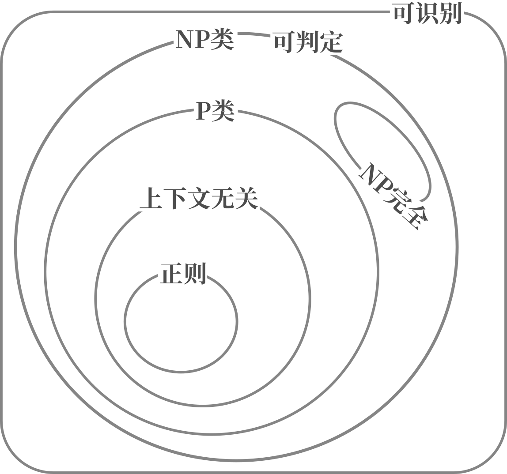

## 《神们自己》

> 作者：阿西莫夫
> 
> 来源：图书馆借的
> 
> 阅读天数：<一周

一本部头不算太大的小说，情节也相对单纯，构思很有意思。

在本书设定中，世界存在多个不同的宇宙，各自有不同的自然规律，并且可以通过“电子通道”互相传递物质，获取能量。而这样的无尽能源并非毫无代价，电子通道的运行会导致两个宇宙的自然规律趋同，对人类而言，长期来看太阳会发生爆炸。第一部分便是关于此。

在另一个宇宙，生物有着完全不同的繁殖模式和社会结构——三性生殖，三性包括理者（左）、情者（中）、抚育者（右）。这些“人”的形态似乎接近气体。理者善思，情者多情，并需要更多能量，有更强的同性社交需求（闺蜜），抚育者则愚钝保守。三性做爱时，会在很长时间里失去意识，条件适当是会按照理者、抚育者、情者的顺序生育。当理者意识到时机合适时，三者会结合而一起“逝去”。由于强作用力更强，这个宇宙聚变更容易发生，恒星不仅稀少，而且冷。如果情者无法获得足够能量，就会导致不容易生出小情者，因此这个宇宙的“人”迫切需要替代能源。三性结合是会，三者以一个长老个体的形式存在，会比原先更加致密。

在本书设定的年代，月球已经得到开发，并且在移民后代中已经产生的某种分离主义。长期在月球的人难以适应地球生活，地球新移民却可以慢慢适应月球生活。人工受精是月球人类的主要繁育方式。月球的合成食物完全无法与地球的传统食物媲美。在作者的设定中，月球代表着人类新的未来，似乎就好像在大航海时代，新大陆比旧大陆更具活力、更少发生战乱、更具创新精神，也更开发。设定中月球人喜欢裸体。故事还暗示了遗传工程在明令禁止后仍然取得了新进展。本书设定，存在某个与预言能力相关的基因，这个基因可以让人的直觉更加可靠，遗传工程借此来产生预言者。

月球分离主义者试图利用电子通道将月球整个带走，但这一阴谋最后遭到挫败，在全月公投中，“流浪月球”被否决。

主要出场人物：

- 第一部分：拉蒙特、布罗诺斯基、狄尼森、哈兰姆、巴特议员

- 第二部分：杜阿、奥登、崔特、长老罗斯腾、（伊斯特伍德）

- 第三部分：狄尼森、赛琳娜·琳德斯托姆、戈德斯坦、巴伦·内维特

一个被激怒的蠢材可能比漫不经心的天才更容易取得成果。第一部分就是这么展开的。狄尼森不经意间的言语伤到了哈兰姆的自尊心，间接促使哈兰姆探究瓶中钨发生变化的原因。哈兰姆最终在同事的启发下，颠覆性地提出了电子通道理论，然后成为学阀掌控整个学界。拉蒙特在撰写电子通道史的时候，发现了与官方记载不同的文献，指出哈兰姆并非独立发现电子通道。很快，拉蒙特就遭到哈兰姆的迫害，被边缘化。

被激怒的拉蒙特想要指出电子通道现有理论的漏洞。他找到了，并且推算出太阳实际的爆炸时间可能比现有理论预测的要更早。但是使用的数学工具不够浅显，并未得到重视。他找到布罗诺斯基共同工作，尝试与电子通道另一头的世界进行联系，得到了“通道坏坏坏”的消息，但没有将之公开。拉蒙特找到过巴特议员，但未能说服他采取行动，为他的研究获取必要的资源——月球上的加速器。最后因学阀的迫害，拉蒙特身败名裂。

在另一个世界，长老伊斯特伍德发现了电子通道，并且打算将之作为主要的能源获取手段。崔特、杜阿、奥登分别是三个特别的抚育者、情者和理者。崔特比一般的抚育者更加大胆，杜阿兼具情者和理者的特性（也因此被其他情者孤立），奥登是理者中的佼佼者。由于童年隐形，杜阿不愿逝去，因此一直不获取足够的能量，避免做爱，进而避免生出小情者，因为她认为小情者的诞生意味着逝去的时候要到了。

某次机缘巧合，杜阿在长老岩洞中发现了电子通道，并在和奥登的交谈中渐渐意识到对另一个世界的危害。杜阿不愿因本世界的利益损害另一个世界的利益，一次向电子通道另一端发出“通道坏坏坏”的信息。于此同时，崔特冒险找到长老，并且偷回人造食物（用以替代恒星的辐射），最后让杜阿食用了人造食物，得到了足够能量，自然而然做爱并产下小情者。

由于杜阿、崔特两人造成的危机，罗斯腾不得不暗示奥登逝去的时机。理者奥登最后终于明白了逝去的含义，说服杜阿和崔特，三人最后共同逝去，永远变成了长老伊斯特伍德。

故事线回到人类世界的月球。狄尼森为了躲避学阀，打算移民月球重新开始。导游赛琳娜对他产生了兴趣，加之伴侣巴伦的指使，不断靠近狄尼森以获取情报。前巴特医院的手下、刚刚履新的月球专员戈德斯坦也对狄尼森产生兴趣，暗示他可以得到他想要的资源，以验证电子通道的危险性。

在赛琳娜的帮助下和指点下，狄尼森逐渐适应月球生活，也意识到赛琳娜是个预言者。他慢慢证实了电子通道的危害性，并且一并得到了解决方案——开辟到第三个宇宙的电子通道。戈德斯坦最终帮助他发表了调查报告，恢复了拉蒙特的名誉，并把哈兰姆拉下神坛。狄尼森和赛琳娜直接逐渐产生爱情，这让正主巴伦·内维特十分吃醋。巴伦一直利用赛琳娜的预言能力，并且极力对外隐藏。他让赛琳娜接近狄尼森，纯粹是为了在月球开辟电子通道，以便实行他的“流浪月球计划”（书里没有这个名字，但是这样形容比较形象），即带着月球离开地球。当然他没用成功，他不能代表所有月球人，流浪月球最后被公投否决。

## 《OpenGL编程指南》

> 原书第9版
> 
> 译者：王锐 等
> 
> 阅读时长：>一个月

一本介绍OpenGL的大部头，适合OpenGL进阶使用。这一版里面大量使用OpenGL 4.5的特性，如果需要使用OpenGL4.3来复现，那么需要自己替换掉一些函数。

但是因为部头太大、太全，各种例子不可能都放得非常完整，有时候我甚至觉得不如直接读OpenGL的spec……部分章节翻译稀烂，明显是拿机翻来糊弄读者。而且出版这么多年了，出版社和译者似乎没有没有要勘误的意思。拉黑这个译者了。

书是好书，但总体上来说不推荐中文版。

## 《计算理论导引》

> 阅读时长：>一个月

比较浅显的计算理论导引。大概三个部分，自动机，可计算性理论，复杂度理论。比较重视证明，但是后面有些部分又不给完整证明。

总体来看是比较有意思的一本书。

摘录一些比较有意思的结论

1. 正则文法、NFA、DFA、GNFA之间的等价性

2. 正则语言的性质：泵引理

3. 上下文无关文法和PDA之间的等价性

4. 上下文无关语言的性质：泵引理

5. DPDA和PDA不等价，句柄，LR(k)

6. 图灵机的定义，可判定性，可识别性

7. 图灵机及其变种（多带图灵机、非确定图灵机等）和枚举器的等价性

8. 希尔伯特第10问不可解，即不存在一个算法可以检测任意多项式是否存在整数根

9. Church-Turing论题：算法的直观概念相当于图灵机算法

10. $A_{\mathrm{TM}}$不可判定（使用对角化方法证明，和证明$\R$不可数很类似）

11. 可判定相当于图灵可识别+补图灵可识别

12. 逻辑理论不一定是可判定的，比如$\mathrm{Th}(\N, +,\times)$. 这部分和和哥德尔不完备似乎有点关系

13. 递归引理，$A$可以输出$\langle A \rangle$

14. k带图灵机上$t(n)$，转化为单带图灵机至少需要$t(n^k)$

15. 非确定图灵机上$t(n)$，转化为确定图灵机至少需要$t(2^{O(t(n))})$

16. P类问题：能被图灵机多项式时间内判定

17. NP类问题：能被图灵机多项式时间内**验证**。验证意味着需要一个凭证，或者叫证明。

18. 上下文无关语言属于P类，一般的哈密顿回路属于NP类，子集和问题属于NP类，SAT问题属于NP类

19. 规约和NP完全（NP-C），简单的问题可以规约为更难一点问题。所有NP问题都可以被规约到一类NP问题上，称之为NP完全问题。证明利用了3-SAT问题，所有NP问题都可规约到SAT问题，SAT可以规约为3-SAT。只要证明一个问题和3-SAT问题可以互相规约，就能证明其NP完全性。（这里的“规约”都是指多项式时间规约）

20. P=NP?是个未解难题。下图假定$\mathrm P\sub \mathrm{NP}$

21. 哈密顿回路、子集和问题、SAT问题、最大团问题、顶点覆盖问题都是NP完全问题

22. 空间复杂度：略

<figure>

</figure>
