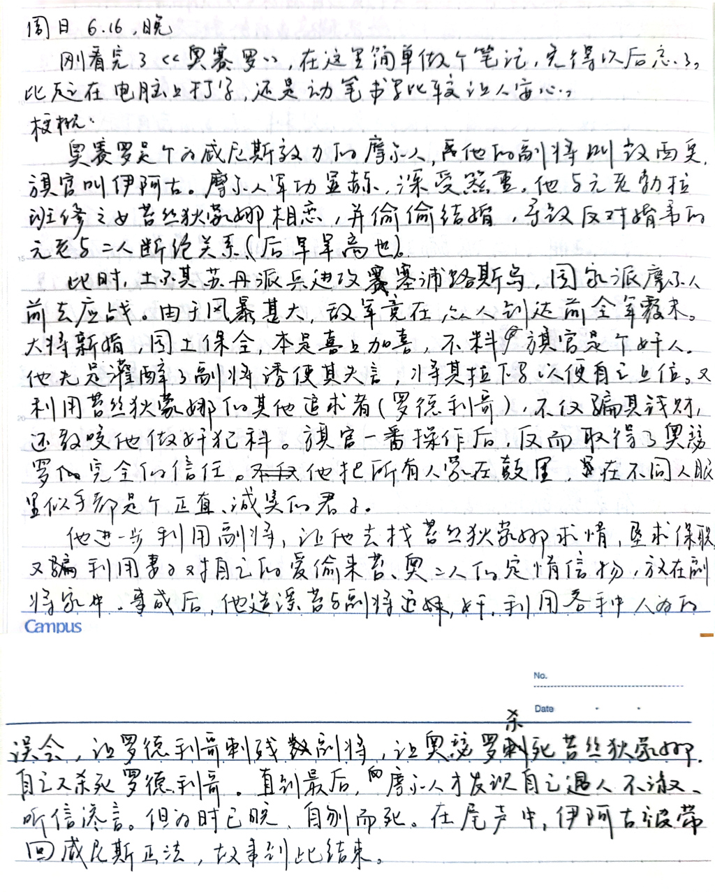
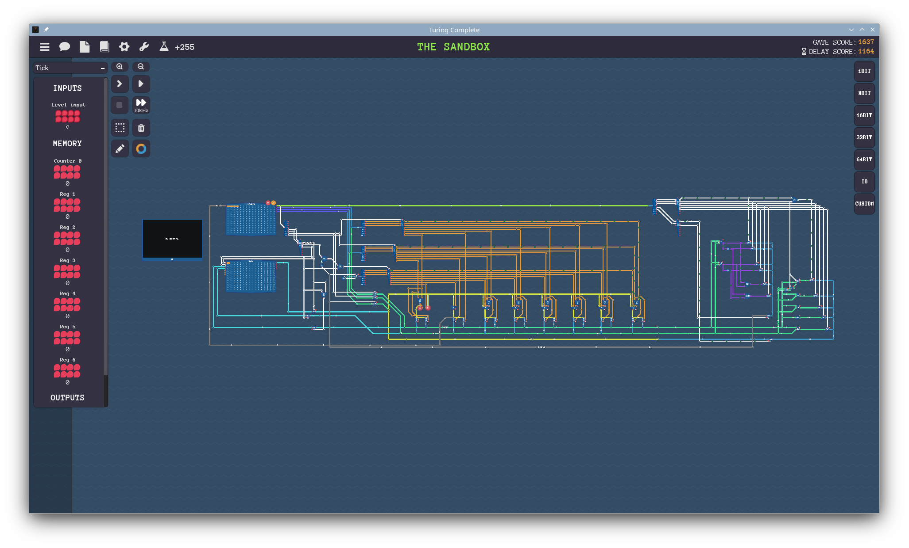

## 《奥瑟罗》《仲夏夜之梦》

> \#莎士比亚补完计划

两年前备考的时候，用午休的时间在图书馆补完了哈姆莱特。最近刚看完《是！大臣》和《是！首相》，莫名其妙又想继续补莎士比亚了。不过可惜看不懂原文，没法体会到原文的押韵和节奏。

《仲夏夜之梦》是个（我认为比较无聊）的喜剧，剧情大致有三条线

1. 忒修斯和阿玛宗女王希波吕忒成婚。雅典有两对情人AB和CD，AB互相爱恋，C爱D，D却爱A，A的家长不支持AB，而支持AD。于是AB私奔，D跟踪A，C跟踪D。
2. 森林里面，仙后和奥布朗感情不合，闹矛盾。
3. 一群工匠在森林里排练剧目，准备献给忒修斯。

奥布朗手下有个淘气的精灵迫克，喜欢捉弄人。迫克有种药，可以让人爱上醒来看见的第一个动物。各种阴差阳错下（比如歧义、误会、巧合），B不再喜欢A，转而喜欢C，工匠里面最好笑的一个人变成了驴头，还被仙后喜欢上了。好在迫克用解药将场面还原回了最理想的状态——有情人终成眷属，仙后和奥布朗和解。回想起当夜的事情，当事人只是觉得做了一个十分怪诞的梦。工匠们的剧目也得到了忒修斯的赞扬。

虽然我看得莎士比亚剧本不多，但莫名感觉他很喜欢搞剧中剧……歌德的《浮士德》里面也有致敬《仲夏夜之梦》的部分（所以就出现剧中剧中剧了……）。

奥瑟罗的笔记我是用手写的，见图。



据说莎士比亚最喜欢用五步抑扬格（iambic pentameter），上油管搜了一点视频，确实挺有意思。算是知道英语念诗的那种怪语气是怎么来的了。充分利用英语的词汇的轻重音来进行创作，的确是不可翻译的。于是心血来潮抄了一首十四行诗，不过还没背下来。

```text
Sonnet 18

Shall I compare thee to the summer's day?
Thou art more lovely and more temperate:
Rough winds do shake the darling buds of May,
And summer's lease hath all too short a date;
Sometimes too hot the eye of heaven shines,
And often is his gold complexion dimm'd;
And every fair from fair sometimes declines,
By chance or nature's changing course untrimm'd;
But thy eternal summer shall not fade,
Nor lose posession of the fair thou ow'st;
Nor shall death brag thou wander'st in his shade,
When in eternal lines to time thou grow'st:
  So long as men can breathe or eyes can see,
  So long lives this, and this gives life to thee.
```

## 《信号与系统》

> Alan V. Oppenheim

很久以前（指2021年）的时候尝试在b站上看课学信号，当时刚学完模电数电，正是趁热打铁的好时候。但无奈当时数学底子太薄，卡在了微分方程那一节。现在则是反过来了，傅里叶变换什么的早就变得不那么深奥了，深奥的反而是电路知识。

如果早点正经地学一下信号，当时不至于搞不懂卷积、滤波、傅里叶变换、拉普拉斯变换。现在回头再来学，姑且算是亡羊补牢。

顺便还看了一下FFT，算是了了高中时代的念想。

## 《买对保险》

在图书馆的还书架看到后，顺手就借回来了。重复度较高的“入门书”，有的地方甚至像是广告。实际上看个前言就够了。

## 《倚天屠龙记·一》

父母辈学生时代的热门读物。金庸老爷子笔力确实强大，读来引人入胜，很多桥段确实经典。但是看着看着，莫名感觉有点疲乏了，常常是高手过招，又出现个高手中的高手跳出来抢镜头，这样的桥段看久了也有点累。

借了《二》，但是感觉不会再有闲工夫专门来看了，就提前还了。

## 《大家的日语·初级2》

终于把初级学完了。其实两年前就能学完的，只不过因为各种各样的原因中断了，到今年四月才重新捡起来。在b站上看了出口仁老师的课之后，学习速度快了很多，可惜没有找到他中级的课程。

于是买了标日的中级——看了之后才发现《大家的日语》真的是超级简明，果然是更适合自学。

---

## 《是！大臣》《是！首相》

两部撒切尔时代的英国政治剧。（说不定能当作撒切尔的竞选广告了）

这两部剧的主线是Hacker和Humphrey的权斗，反映的是英国政客和公务员体系的权斗。当然我认为还有一条暗线，就是Bernard各种暗中帮助Hacker，两头得利，慢慢上位的暗线。Bernard是我最喜欢的主角，它在剧里的言论有时显得有点呆，但常常值得仔细品味。

> "You can't cut [through the red tapes] with a hammer."

有评论说Humphrey是道德真空，我觉得他远远不是，反而唯选票是从的典型政客Hacker，才是真正的道德真空。

我以前觉得“半部英剧治天下”是对本剧夸张的评价，现在觉得是精辟的调侃，谁也说不清这部剧到底是拍得夸张了，还是拍得保守了——在电视上是喜剧，放现实中就是大英民主制度的悲剧了。作为一部对白十分精彩的喜剧，值得我n刷。

## 《生活大爆炸》

久负盛名的美剧。去年还在宿舍的时候和舍友看了一点，今年走出宿舍有闲工夫了，一口气看到了第五季。看得很爽，可能是因为我自己就是个nerd/geek，所以会觉得这些nerd的故事有意思。美剧荤段子确实多，但起的作用至多算是插科打诨，不算是它真正有趣的地方。

---

## 差一点通关《图灵完备》

以后把游戏也列到读书笔记里面来吧，我感觉玩游戏的体验和看书差不多。

玩这游戏相当于在复习计组原理，相见恨晚。因为不久前刚考完研，两天就打到最后一层了。后面的汇编题目感觉有点无聊（也有点难），就不打算再打了。能在游戏的引导下设计一个简单的处理器，我已经满足了。



## 20 mini mazes

应该是我这个月玩到的最好的小游戏。关卡设计很有创意。
