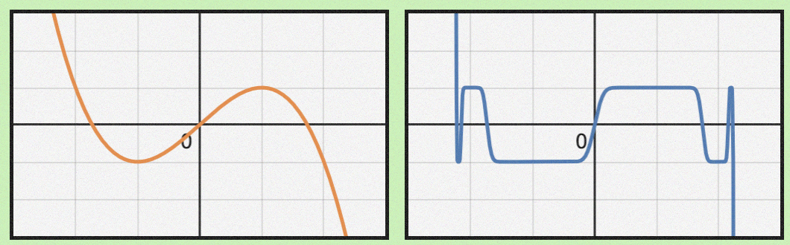

## 使用场景

稠密的线性层。因此排除了embedding层和分类层。

## 计算

总体上和momentum类似。但是，在更新前对更新量做一下`NewtonSchulz5`操作。其中参数`G`是更新量。

<figure>

<caption>muon算法流程</caption>
</figure>

```python
def newtonschulz5(G, steps=5, eps=1e-7):
    assert G.ndim == 2
    a, b, c = (3.4445, -4.7750, 2.0315)
    X = G.bfloat16()
    X /= (X.norm() + eps)
    if G.size(0) > G.size(1):
        X = X.T
    for _ in range(steps):
        A = X @ X.T
        B = b * A + c * A @ A
        X = a * X + B @ X
    if G.size(0) > G.size(1):
        X = X.T
    return X
```

苏剑林的博客里面写的是（$W$是参数矩阵，对应上面的$\theta$）：
$$
W_t = W_{t-1} - \eta_t [\mathrm{msign}(\boldsymbol M_t) + \lambda W_{t-1}]
$$
则是加了梯度衰减的版本，类似Adam变成AdamW。

Deriving Muon当中写的是：
$$
W \gets W - \eta \times \sqrt{\frac{\texttt{fan-out}}{\texttt{fan-in}}} \times \mathrm{NewtonSchulz}(\nabla_W \mathcal{L}).
$$
fan-out和fan-in分别是输出和输入的维度（参数矩阵$W$的维度）。

## 推导

> 本节内容主要直接从Deriving Muon里面抄

### “稠密”和RMSNorm

线性层主要处理“稠密”的向量，这里的所谓“稠密”指的是大部分位置的值都接近1或者-1（能量分布比较均匀）。可以用RMSNorm来量化“稠密性”：
$$
\|v\|_\text{RMS} := \frac{\|v\|}{\sqrt{d}}
$$
之所以除以$\sqrt{d}$，是为了兼容不同维数的向量，不管什么维度，“稠密”的向量RMSNorm会在1附近。如果都用L2范数，高维度对应的norm会更大。在Transformer里面，我们几乎每一层Linear后面都要加上LayerNorm，可以理解为为了鼓励稠密性，抑制稀疏性。

那么权重矩阵会怎么影响RMSNorm呢？考虑 $y = Wx$，那么
$$
\|y\|^2 = y^Ty = x^TW^TWx
$$
定义RMS到RMS映射的范数如下，意义是矩阵最大能把一个向量缩放到什么程度。
$$
\|W\|_\mathrm{RMS\to RMS} := \max_{x\ne 0}\frac{\|y\|_\mathrm{RMS}}{\|x\|_\mathrm{RMS}} = \sqrt{\frac{d_x}{d_y}}\cdot \max_{x\ne 0}\frac{\|Wx\|}{\|x\|}
$$
所以其实就是$W^TW$的最大特征值，即$W$最大奇异值的平方，即$W$的谱半径$\rho (W)$。$\|y\|$永远不会比$\rho(W)\|x\|$大。$d_x$和$d_y$分别是x和y的维度，其实就是原公式的fan-in和fan-out。

于是，考虑用$\Delta W$更新参数后，线性层输出的变化：
$$
\Delta y = (W+\Delta W)x - Wx = \Delta W x
$$
会有
$$
\|\Delta y\|_{\mathrm{RMS}} \le \|\Delta W\|_\mathrm{RMS\to RMS} \cdot \|x\|_\mathrm{RMS}
$$

### 参数更新的效率

我们希望参数更新之后，loss下降最多。考虑每个参数$W_{ij}$，我们希望最小化更新后的loss，即$\mathcal L(W + \Delta W)$。同时希望输出维持稠密性，即稠密性的变化要控制在阈值$\eta$以内。为了方便，我们把$\mathcal L(W + \Delta W)$泰勒展开到一阶，忽略高阶项
$$
\begin{aligned}
& \min_{\Delta W_{ij}} \mathcal L (W) + \frac{\partial \mathcal L(W)}{\partial W_{ij}}\Delta W \\
\mathrm{s.t.\ } & \|\Delta y\|_{\mathrm{RMS}} \le \eta
\end{aligned}
$$
把所有$W_{ij}$写到一块之后就是，并且注意到$\mathcal L(W)$在这里相对于$\Delta W$是个常数，问题变为最小化这两个矩阵的Frobenius内积
$$
\min_{\Delta W} \langle \nabla_W \mathcal L, \Delta W\rangle
$$
$\|x\|_{\mathrm{RMS}}$也和$\Delta W$无关，问题变成
$$
\begin{aligned}
& \min_{\Delta W} \langle \nabla_W \mathcal L, \Delta W\rangle \\
\mathrm{s.t.\ } & \|\Delta W\|_\mathrm{RMS\to RMS} \le \eta'
\end{aligned}
$$
但是可以直观感受到，把$\nabla_W\mathcal L$每个特征向量方向都取$-\eta'$即可，让他在可控范围内尽量负。或者说，每个特征向量的方向都均等地更新，不因梯度的贡献量而偏袒某个方向。由于梯度不一定是方阵，所以用SVD而不是特征值分解。
$$
\Delta W = -\eta' \sqrt{\frac{d_x}{d_y}} \cdot UV^T
$$

### 绕开SVD

在矩阵很大的时候，SVD是个代价比较高的操作。因此需要找到高效的方式计算
$$
\nabla_W\mathcal L = U\Sigma V^T \mapsto UV^T
$$
这个映射就是上面苏剑林博客里的$\text{msign}(\cdot)$函数，可以看作符号函数的推广。

此处的所谓Newton-Schulz方法，核心在于利用奇次矩阵多项式的性质
$$
p(X) = Up(\Sigma)V^T
$$
相当于直接作用于奇异值。

于是乎作者找到一个多项式
$$
p_3(\Sigma) := \frac{3}{2} \cdot \Sigma - \frac{1}{2} \cdot \Sigma \Sigma^\top \Sigma.
$$
一维情况打出来如下图左。反复应用这个多项式如图右，会发现在$\pm 1$附近，趋近于符号函数了。



一般只迭代5次，上面的newton_schulz5里面的那三个系数，大概是5次迭代的较优解。

### 超参设置

根据苏剑林的说法，如果用Adam迁移到Muon，需要将学习率放大$0.2\sqrt{d}$倍，一般大约是10倍。所以他们做的moonlight版Muon还在根号前面多乘了$0.2$，而且为了方便把根号下的内容改成了fan-in和fan-out中的较大值。

### 这个多项式是怎么来的


## ref

- [deriving muon](https://jeremybernste.in/writing/deriving-muon)
- [Muon优化器赏析：从向量到矩阵的本质跨越](https://spaces.ac.cn/archives/10592)
- [Muon: An optimizer for hidden layers in neural networks](https://kellerjordan.github.io/posts/muon/)