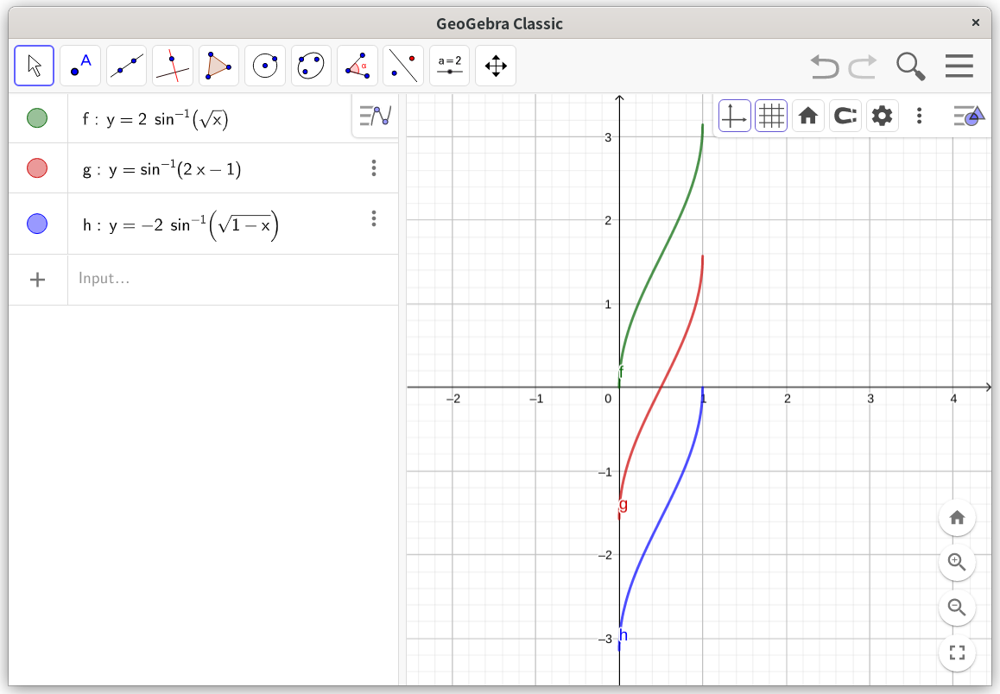

## 起因

求积分

$$
\int \frac{dx}{\sqrt{x(1-x)}}
$$

---

## 解法

### 解法一：答案的解法

$$
\begin{aligned}
&\int \frac{dx}{\sqrt{x(1-x)}} = 2\int \frac{dx}{2\sqrt{x}\cdot\sqrt{1-(\sqrt{x})^2}} \\
= & \int \frac{d(\sqrt{x})}{\sqrt{1-(\sqrt{x})^2}} = \arcsin{\sqrt{x}}  + C\\
\end{aligned}
$$

嗯，对，没有任何毛病，$t=\sqrt{x}$的换元也很巧妙。

### 解法二：我起初的解法

$$
\begin{aligned}
& \int \frac{dx}{\sqrt{x-x^2}} \\
= & \int \frac{dx}{\sqrt{\frac{1}{4} - \left(x^2-\frac{1}{2} \right)}} \\
= & \int \frac{d(2x-1)}{\sqrt{1-(2x-1)^2}} = \arcsin{(2x-1)} + C
\end{aligned}
$$

很暴力，直接配方，但是似乎也找不出毛病，积分结果和上面看起来完全不同。（因为一开始我画错了图，所以甚至以为不是同一个函数）。求导一下，发现导函数和答案得到的一样。

### 解法三：Wolfram Alpha的解法

$$
\begin{aligned}
& \int \frac{dx}{\sqrt{1-x^2}} \\
= & \int \frac{dx}{\sqrt{\frac{1}{4} - \left(\frac{1}{2} - x^2 \right)}} \\
= & -2\int \frac{d(\sqrt{1-x})}{1 - (\sqrt{1-x})^2} \\
= & -2\arcsin{\sqrt{1-x}} + C
\end{aligned}
$$

思路诡异，但是没毛病，也许这就是机器和人的差别吧。可是凭什么说这个函数和前面两个函数是一样的？虽说求导结果一样。

## 函数图像

求导结果一样就意味着函数图像应该形状相同。其实也确实是相同的，用GeoGebra画出来的图如下。

ps. 一开始我画错图了，导致我一直被图误导

---

## 证明

关于答案和wolframalpha的结果，使用对称性可破。

关于我的结果和答案，则需要使用半角公式。也就是证明$2\arcsin\sqrt{x} - \arcsin(2x-1) = C$

证明：

首先，设

$$
\begin{aligned}
& y_1 = 2\arcsin\sqrt{x} \\
& y_2 = \arcsin(2x-1)
\end{aligned}
$$

那么有

$$
x = \sin^2\frac{y_1}{2} = \frac{1 + \sin y_2}{2}
$$

另有

$$
\sin^2 \frac{y_1}{2} = \frac{1-\cos{y_1}}{2}
$$

故

$$
1-\cos{y_1} = 1 + \sin y_2 \Leftrightarrow \sin y_2 = -\cos y_1 = \sin (y_1 + \frac{\pi}{2} + 2k\pi)
$$

所以

$$
y_2 = y_1 + (4k+1)\frac{\pi}{2}
$$

证毕。对于这个情况，$k=-1$。

---

## 总结

不仅仅涉及三角函数的积分可能没有所谓”最简“的结果，涉及反三角函数的积分可能也没有”最简“的结果，但正确结果之间肯定是相互等价的，这点大可放心。

三角函数的半角公式应用到反三角函数中，可以得到一波稀奇古怪的公式。

$$
\arcsin(2x^2-1) = 2\arcsin x - \frac{\pi}{2}
$$
