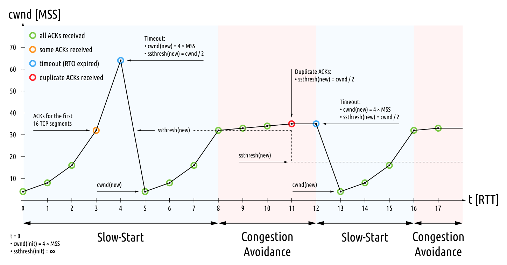

## 为何要引入拥塞控制

首先，如果不进行拥塞控制，控制各个发送端发包的速度，那么网络将拥挤不堪，各方都难以成功发送消息。并且仅仅在网络层控制拥塞是治标不治本的，因为拥塞的根源在于发送端过快的发送速度，给网络层带来巨大负担。

其次，即使引入了流量控制，网络拥塞的问题依然没有得到根本解决。

流量控制和拥塞控制目的不同。流量控制中的窗口反映了接受端的接收能力，但是并没有反映网络的容量，而发送端的发送量应该同时受二者控制。

## 拥塞控制的基本原理

原理：接收方ACK〔应答〕的速率反映了网络传输能力，发送方可以据此控制发送速率。

以下内容假设发送的“包”长度都等于MSS〔最大报文段长度〕。

我们假设网络的容量是当前数据传输的瓶颈（也就是网络传输能力低于发送端的发送能力，也低于接受端的接收能力，此时便是拥塞控制应该发挥作用的时候）。发送端每秒发送$n$个包，接收端每秒接收$m$个包，网络层每秒传输却只能传输$k$个包，$m < n < k$。

如果发送端每秒发出$n$个包，经过网络层之后，接收放每秒也只能接收到$k$个包。接收每收到一个包，就发回一个ACK，所以发送端每秒收到$k$个ACK。因此发送方可以知道网络当前的容量是每秒钟$k$个包。调整发送速率到每秒$k$个包，就算是进行了拥塞控制。

> 滑动窗口反映了接收方的接收能力，因此发送方可以知道现在的传输瓶颈究竟是网络传输能力，还是接收方的接收能力。

## 拥塞控制的难题

和TCP计时器控制一样，协议必须面对多变的网络环境。网络传输能力时时刻刻都在发生变化，因此拥塞控制必须动态地适应这一变化，及时“收敛”到最佳的发送速度上去。这便是TCP拥塞控制要解决的问题。

## TCP的拥塞控制

> 这部分内容在[RFC 2851](https://www.rfc-editor.org/rfc/rfc2581.html)有详细、清晰的说明，我只是RFC的搬运工罢了。RFC的讲解比很多教材清晰明了，建议阅读。

拥塞控制涉及到4个关键的算法：慢开始，拥塞避免，快速重传，快速恢复。

涉及一些定义：

1. `SMSS`：发送方最大报文段长度
2. `IW`：初始拥塞窗口大小，三次握手之后使用这个作为拥塞窗口的初值
3. `FlightSize`：已经发出但是未应答的包的个数

涉及几个关键的状态变量：

1. `cwnd`：拥塞窗口大小。不同实现方式中含义不同，有的按「全长包」的个数计算，有的按字节数计算
2. `rwnd`：接收方的窗口大小
3. `ssthresh`：决定「慢开始」算法和「拥塞避免」算法的选用

### 慢开始和拥塞避免

首先，设置`cwnd`初值为`IW`，`ssthresh`初值为一个任意大的值。然后进入慢开始阶段。

#### 慢开始阶段

慢开始阶段，每收到一个ACK，便让`cwnd`至多增加`SMSS`。如果按「全长包个数」计算，就是加一。

慢开始算法一点也不“慢”。考虑上述算法的表现，慢开始阶段，每个RTT〔往返时间〕`cwnd`都倍增一次。当`cwnd`大于或者等于`ssthresh`的时候，进入拥塞避免阶段。

> 在`cwnd`和`ssthresh`相等的时候，标准并没有规定用哪一算法，因此取决于具体的TCP实现。

#### 拥塞避免阶段

拥塞避免阶段，每个RTT内`cwnd`增加`SMSS`。如果按「全长包个数」计算，就是`cwnd`在每个RTT增加1。当「发现拥塞」的时候，拥塞避免阶段结束。

> 实际中不好统计RTT。因此可以对于每个不重复的ACK，执行一次
> 
> `cwnd` = `SMSS` * `SMSS` / `cwnd`

#### 「发现拥塞」

当「超时重传」的现象出现，我们就认为拥塞发生了。这就是「发现拥塞」的方式。

当发现拥塞的时候，将`ssthresh`重新设置为以下值。

`ssthresh` = max(`FlightSize` / 2, 2 * `SMSS`)

> 实际上是将发送窗口折半，但是至少可以发送两个包。如果传输速率受制于网络传输能力，那么其实就是把`ssthresh`设置为`cwnd`的一半。
> 
> 但是为什么不能直接设置为`cwnd`的一半？标准说这样可能会使`ssthresh`超过`rwnd`。

> Tanenbaum的教材中直接就说设为当前`cwnd`的一半。

重设`ssthresh`之后，`cwnd`回到初始值重新进行慢开始。

### 快速重传和快速恢复

引入这两个算法是为了加快收敛速度。

当接收方收到失序的报文段时，应立即回复一个“重复的ACK”，指明期望接收的序列号应该是多少。当失序的情况发生，意味着网络传输能力的不足。发送方通过观察重复的ACK，可以作出一些操作来控制拥塞。当然，网络错误也有可能造成重复ACK。

当发送端收到第三个重复的ACK时，按照之前发现拥塞的算法重设`ssthresh`（如果按照教材上的说法，就是折半`cwnd`）。然后立即重发可能丢失的包，不必等超时重传（这就是快速重传）。接下来，设置`cwnd`为`3*SMSS+ssthresh`（如果按照全长包来计算，就是`cwnd`设为`3+ssthresh`。

> 为什么要人为使`cwnd`“膨胀”3？因为三个重复ACK意味着接收方收到了三个失序的包，或者说，有三个包实际上已经离开网络了。

重传之后，每收到一个重复的ACK，`cwnd`就增加一个`SMSS`，或者从全长包个数的角度说，就是增加1。

> 同上，意味着又有一个包离开网络了。

收到下一个ACK的时候，进行一次“收缩”，将`cwnd`设为`ssthresh`（这就是快速恢复）。接下来因为`cwnd >= ssthresh`，因此应该使用拥塞避免算法。

## TCP拥塞控制的表现

如果记录每个RTT传输的包数，将得到一张锯齿状的折线图。图片来自WikiCommons。

## 更多拥塞控制的方法

1. 引入SACK〔选择性ACK〕。允许声明哪些「区间」的字节已经收到。更有利于高效地重传

2. 引入ECN〔显性拥塞通知〕。网络是否拥塞，网络层自己本身最清楚，ECN允许网络层给传输层反馈，直接告知拥塞情况。

## 参考资料

1. RFC 2851

2. Tanenbaum, A.S. and Wetherall, D.J: *Computer Networks 5th edition*

