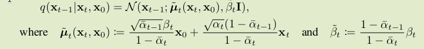

## 前向过程

原始数据记为$x_0$，前向过程$q$就是逐步加上不同强度的高斯噪声

$$
q(x_t|x_{t-1}) = \mathcal N (x_t; \sqrt{1-\beta_t}x_{t-1}, \beta_t \bold I)
$$

也就是说，$x_t = \sqrt{1-\beta_t}x_{t-1} + \sqrt{\beta_t}\epsilon_t$，$\epsilon_t \sim \mathcal N (0, \bold I)$

这一步就是某种扩散。$\beta_t$反映了噪声的强度，至于$x_t$前面要乘上$\sqrt{1-\beta_t}$，应该是为了保持图像的“能量”总体上不变。可以给定$x_0$，$x_t$

$$
x_t = \sqrt{(1-\beta_t)(1-\beta_{t-1})\dots(1-\beta_1))}x_0 + \sqrt{\beta_t}\epsilon_t + \sqrt{\beta_{t-1}}\epsilon_{t-1} + \dots + \sqrt{\beta_1}\epsilon_1
$$

每一步的噪声都是独立的。两个独立的高斯分布的线性组合还是高斯分布。

$$
x_t = \sqrt{\prod (1-\beta_t)} x_0 + \sqrt{\prod \beta_t} \bar\epsilon_t
$$

假设每一步增加的噪声都很小，方差的乘积可以忽略不计，可以近似写成。

$$
q(x_t|x_0) = \mathcal N(x_t; \sqrt{\bar \alpha_t}x_0, (1-\bar \alpha_t)\bold I)
$$

其中$\bar \alpha_t = \prod^t_{s=1} (1-\beta_s)$，这种写法可以简化后面的公式。

上面的公式表明，前向过程其实是个Markov过程，下个状态$x_t$只依赖上一个状态$x_{t-1}$。联合分布可以直接写出来

$$
q(x_{0:T}) = q(x_0)\prod_{t=1}^{T} q(x_t|x_{t-1})
$$

## 反向过程

直接假定反向过程的状态转移概率也是某种高斯分布，用参数为$\theta$的神经网络拟合这个分布的均值和协方差。给定$x_t$，预测$x_{t-1}$，用高斯分布去拟合$x_{t-1}$在给定$x_t$之后的后验概率分布。

$$
p(x_{t-1}|x_t) = \mathcal N(x_{t-1}; \mu_\theta(x_t, t), \Sigma_\theta(x_t, t))
$$

反向过程从$x_T$出发，反向预测$x_0$。因为加了很多噪声，可以认为$p(x_T) \sim \mathcal N(0, \bold I)$

可见，也是Markov过程，联合分布同样可以直接写出来。

$$
p(x_{0:T}) = p(x_T)\prod_{t=1}^{T}p(x_{t-1}|x_t)
$$

## 损失函数

有个前向过程和反向过程，我们直接把$x_{1:T}$当作是隐变量，$x_0$是显变量，直接套用ELBO作为优化目标，就能同时最大化似然函数，最小化KL散度。

$$
\mathbb E_{\bold x_{1:T} \sim q(\bold x_{1:T}|\bold x_0)}\left[ \log \frac{p(\bold x_0 | \bold x_{1:T})p(\bold x_{1:T})}{q(\bold x_{1:T}|\bold x_0)}\right]
$$

把上面的联合分布公式代进去

$$
\mathbb E_{\bold x_{1:T} \sim q(\bold x_{1:T}|\bold x_0)}\left[ \log \frac{p(x_T)\prod_{t=1}^{T}p(x_{t-1}|x_t)}{\prod_{t=1}^{T} q(x_t|x_{t-1})}\right]
$$

展开成积分

$$
I_1 = \int q(x_{1:T}|x_0) \log \frac{p(x_T)\prod_{t=1}^{T}p(x_{t-1}|x_t)}{\prod_{t=1}^{T} q(x_t|x_{t-1})} \mathrm{d}x_{1:T}
$$

应用一下贝叶斯公式

$$
q(x_t|x_{t-1}) = \frac{q(x_{t-1}|x_t)q(x_t)}{q(x_{t-1})}
$$

但是$q(x_t)$、$q(x_{t-1})$是没意义的，此时应该意识到$x_0$要作为条件才对。

刚好根据Markov性，$q(x_t|x_{t-1}) = q(x_t|x_{t-1}, x_0)$。所以

$$
q(x_t|x_{t-1}) = q(x_t|x_{t-1}, x_0) =  \frac{q(x_{t-1}|x_t, x_0)q(x_{t}, x_0)}{q(x_{t-1}, x_0)}
$$

代入上面的方程，神奇的事情就发生了

$$
\int q(x_{1:T}|x_0) \log \frac{p(x_T)\prod_{t=1}^{T}p(x_{t-1}|x_t)}{q(x_1|x_0)\prod_{t=2}^{T} \frac{q(x_{t-1}|x_t, x_0)q(x_{t}, x_0)}{q(x_{t-1}, x_0)}} \mathrm{d}x_{1:T}
$$

有点乱，整理一下

$$
\int q(x_{1:T}|x_0) \log \frac{p(x_T)\prod_{t=1}^{T}p(x_{t-1}|x_t)\prod_{t=2}^{T}q(x_{t-1}| x_0)}{q(x_1|x_0)\prod_{t=2}^{T}q(x_{t-1}|x_t, x_0)\prod_{t=2}^{T}q(x_{t}|x_0)} \mathrm{d}x_{1:T}
$$

注意到，$\prod_{t=2}^{T}q(x_{t-1}|x_0)$就是$q(x_1|x_0)\prod_{t=2}^{T-1}q(x_{t}| x_0)$，可以一下子消掉很多因子。

$$
\int q(x_{1:T}|x_0) \log \frac{p(x_T)\prod_{t=1}^{T}p(x_{t-1}|x_t)}{q(x_T|x_0)\prod_{t=2}^{T}q(x_{t-1}|x_t, x_0)} \mathrm{d}x_{1:T}
$$

拆成三项之和。

第一项，利用$q(x_{1:T}|x_0) = q(x_{1:T-1}|x_T,x_0)q(x_T|x_0)$，改变积分顺序，再根据概率密度归一化的性质：

$$
\begin{aligned}
& \int q(x_{1:T}|x_0)\log \frac{p(x_T)}{q(x_T|x_0)}dx_{1:T} \\
=& \int q(x_T|x_0)\log\frac{p(x_T)}{q(x_T|x_0)}dx_T \\
=& -\mathrm{KL}(q(x_T|x_0) \| p(x_T)) \triangleq -\mathcal L_T
\end{aligned}
$$

第二项，地位相当于VAE当中的重构项。

$$
\begin{aligned}
&\int  q(x_{1:T}|x_0)\log p(x_0|x_1)dx_{1:T} \\
=& \int q(x_1|x_0)\log p(x_0|x_1) dx_1 \\
=& \mathbb E_{x_1\sim q(x_1|x_0)}[\log p(x_0|x_1)] \triangleq -\mathcal L_0
\end{aligned}
$$

第三项

$$
\begin{aligned}
& \int q(x_{1:T}|x_0)\log \prod_{t=2}^{T} \frac{p(x_{t-1}|x_t)}{q(x_{t-1}|x_t,x_0)}\mathrm{d}x_{1:T}\\
=&\sum_{t=2}^T\int q(x_{1:T}|x_0)\log\frac{p(x_{t-1}|x_t)}{q(x_{t-1}|x_t,x_0)}\mathrm{d}x_{1:T} \\
=& \sum_{t=2}^T\int q(x_{t-1}|x_t, x_0)\log\frac{p(x_{t-1}|x_t)}{q(x_{t-1}|x_t,x_0)}\mathrm{d}x_{t-1} \\
=& -\sum_{t=2}^T \mathrm{KL}(q(x_{t-1}|x_t, x_0) \| p(x_{t-1}|x_t)) \triangleq -\sum_{t=2}^T\mathcal L_{t-1}
\end{aligned}
$$

总的loss如下，最小化这个loss就是最大化ELBO。

$$
\mathcal L = \sum_{t=0}^T \mathcal L_t
$$

至此loss当中的各项都有明确的意义。$\mathcal L_t$就代表$t$步对应的损失。

这个损失函数是可以计算的。唯一一个看起来没法直接算出来的是$q(x_{t-1}|x_t, x_0)$，但是我们知道$q(x_{t-1}|x_0)$和$q(x_{t}|x_0)$，用一下条件概率公式就能算出$q(x_{t-1}|x_t, x_0)$。另外，这两个都是参数已知的高斯分布，所以其实条件分布的参数可以直接套公式算出来。

从概念上看，前向是$x_0 \rightarrow x_1 \rightarrow \dots \rightarrow x_T$，反向则是反过来。如果不看第一次扩散，变成从$x_1$出发，前向是$x_1 \rightarrow x_2 \rightarrow \dots \rightarrow x_T$，这是可看作另一个扩散过程，起点是$x_1$。如果我们递归地进行思考，照理说上面的ELBO应该可以继续拆分。并且，参考VAE的ELBO，也应该有重构项$\mathbb E_q[p(x_0|x_1)]$。
我们应该可以任意地把整个过程的链条从中间某个位置拆开，切开的位置是显变量，右边是隐变量，左边是条件。但是推了半天，还是得从答案出发硬凑出一个结果，推导好像不是特别直观。

