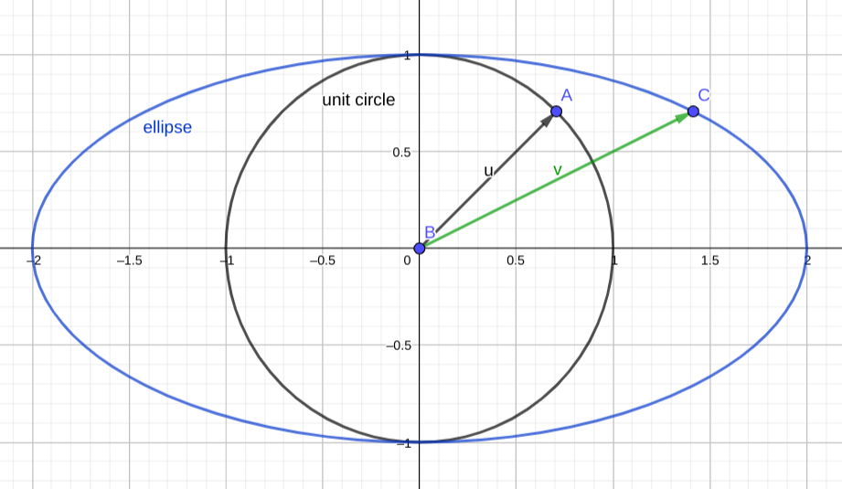
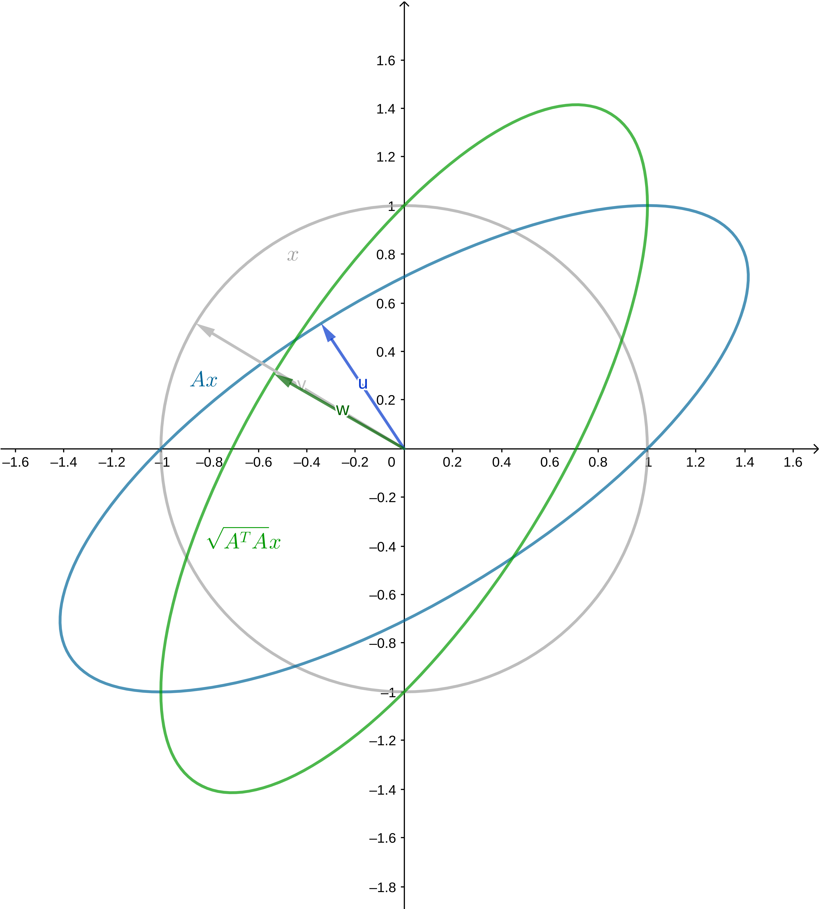

奇异值分解〔SVD，Singular Value Decomposition〕在不少方面有应用，不过初看的话不太容易理解。本文整理了我对SVD的理解，难免存在不严谨的地方，不过希望可以帮助读者理解SVD。

了解一个方法的**动机**是很重要的。我觉得从优化问题入手，并且借助几何方法，比较容易理解SVD的动机。

## 餐前甜点：一个优化问题

现有$m\times n$矩阵$\bold A$，要找到一个$m$维向量$\bold x$，使二者乘积的模最小，也就是求以下优化问题的解：

$$
\begin{aligned}
 &\min \ ||\bold A \bold x|| \\
&\mathrm{s.t.} ||\bold x|| = 1
\end{aligned}
$$

> 如果用线性变换的方式表述问题，线性变换$A \in \mathcal{L}(V,W)$，$x \in V$，求$x$使$||Ax||$最小。

### 问题的转化

可以注意到，最小化$||\bold A \bold x||$其实就是最小化$||\bold A \bold x||^2$，稍一改写，其实就是

$$
||\bold A \bold x||^2 = ||(\bold A\bold x)^T(\bold A \bold x)|| = ||\bold x^T (\bold A^T \bold A) \bold x||
$$

可以注意到$\bold A^T \bold A$是个对称方阵（如果看作是算子，那么是个「自伴算子」），因为它的转置和自身相等。于是接下来重点放在$\bold A^T\bold A$这个「性质良好」的矩阵上，将其记为$\bold M$。

$$
(\bold A^T \bold A)^T = \bold A^T (\bold A^T)^T = \bold A^T \bold A
$$

任何对称方阵都对应一个**二次型**，而这里，我们最小化问题的目标函数正是$\bold M$对应的二次型。

### 具体实例的可视化

在开始介绍SVD之前，可以先来观察几个实例。

比如说我们假定：

$$
\bold M = \begin{pmatrix} 2 & 0 \\ 0 & 1\end{pmatrix}
$$

在二维平面可视化这个矩阵对应的线性变换是很容易的，$y$方向上不动，$x$方向上拉伸到原先的两倍。我们限定了$||\bold x|| =1$，其实就是限定了在**单位圆**上找点。因此我们关心单位圆被这个线性变换映射成了什么图形。

答案是椭圆。如图，单位圆上的点被映射到椭圆上，如果说$\bold x$的图像是单位圆，那么$\bold M \bold x$的图像就是图中的椭圆，很显然，从图中可以看出，$\bold x = (0, \pm 1)^T$的时候，映射后的向量模最小。



> 本例比较简单，如果一定要计算才放心的话，高中数学的方法尚可解决。

上面那个实例中$\bold M$是对角阵。如果$\bold M$不是对角阵是什么情况？下面来看第二个实例。

假设有

$$
\bold M = \begin{pmatrix}
2 & 1 \\ 1 & 1
\end{pmatrix}
$$

$\bold M\bold x$的图像依旧是椭圆，下图中$\bold u$被映射到$\bold v$，方向发生了改变。经过$\bold M$的映射，只有特征向量的方向不会发生改变，因为如果$\bold v$是特征向量，则有$\bold M\bold v = \lambda \bold v$。而恰恰就是特征向量的方向缩小或扩张得最厉害，可以对着下图验证一下。。


> 为什么还是椭圆？
> 
> 这涉及到一个关键的事实：如果我们重新找一对标准正交基，那么$\bold M$在新的基下可以写成一个对角矩阵，那么在新的基下（或者说，新的座标系下），$\bold M\bold x$的方程可以写成标准椭圆方程。
> 
> 为什么可以换座标系这样求解？可以注意到，旧的基显然是标准正交基，如果新的基也是标准正交基，那么在这两个基之间进行变换，其实相当于只是做了一下旋转+轴对称，**没有改变向量的模长**，因此在新的基下求解是可行的。想象一下，把上图的蓝色椭圆“摆正”之后再进行求解。
> 
> 那么为什么可以找到让$\bold M$对角化的标准正交基呢？因为$\bold M$的几个**特征向量恰恰是相互正交**的！读者可以就本例的$\bold M$验证一下。这涉及到**谱定理**，稍后将证明。

> 读者不妨考虑一下如果对称矩阵$\bold M$不满秩的情况（或者说线性变换把高维空间压缩到低维空间是怎样的情况），映射的结果其实是一个退化的椭圆。

到这里，我们大致有解决问题的思路了：找到映射后的椭圆，然后把它摆正，然后容易知道横向和纵向总是“拉伸”或者“压缩”最显著的方向，据此可以求解。这种思想可以推广到高维。

## 谱定理

上面的注解提到了谱定理。谱定理保证了$\bold M$在某个标准正交基下是对角矩阵，也就是可以**正交对角化**。

因此作为SVD的准备，需要先证明谱定理〔the spectral theorem〕。

我们可以从两个不同的角度表述谱定理。

> 本文中谱定理特指「**实**谱定理」，简单说就是针对实数构成的矩阵／实向量空间。

#### 表述

可以这样表述谱定理。

> $n \times n$的矩阵$A$
> 
> 1. $A$有$n$个实特征值（算上重数）
> 2. $A$的特征向量正交
> 3. $A$可以被正交对角化

也可以这样表述谱定理：

> $T \in \mathcal L(V)$，那么以下条件等价：
> 
> 1. $T$是自伴的
> 
> 2. $V$有一个由$T$的本征向量组成的规范正交基
> 
> 3. $T$有关于$V$的某个规范正交基有对角矩阵

#### 概念准备

定理的表述出现了一些国内教学中不常出现的概念，需要先对这些概念及其性质作出解释。

**算子**：$T \in \mathcal L(V, V)$，也就是从$V$映射到$V$的线性变换，则$T$称为$V$上的算子，记为$T \in \mathcal L(V)$

**伴随**〔adjoint〕：给定$T \in \mathcal L(V, W)$（也就是从向量空间$V$到向量空间$W$的线性映射），如果有$T^*\in (W, V)$，取$v \in V$，$w \in W$，使

$$
\langle Tv, w \rangle = \langle v, T^*w\rangle
$$

那么$T^*$称为$T$的伴随。

可以证明一定存在这样的伴随，具体参考LADR。这里只举LADR中的一个例子，通过这个例子可以感受一下为什么伴随一定存在。

> $T(x_1, x_2, x_3) = (x_2 + x_3, 2x_1)$
> 
> $$
> \begin{aligned}
\langle (x_1, x_2, x_3), T^* (y_1, y_2) \rangle = & \langle T(x_1, x_2, x_3), > (y_1, y_2) \rangle \\
= & \langle (x_2 + 3x_3, 2x_1, (y_1, y_2) \rangle \\
= & x_2y_1 + 3x_3y_1 + 2x_1y_2 \\
= & \langle (x_1, x_2, x_3), (2y_2, y_1, 3y_1) \rangle
\end{aligned}
> $$
> 
> 所以$T^*(y_1, y_2) = (2y_2, y_1, 3y_1)$

**伴随相当于矩阵转置**。对于实线性变换，其伴随对应的矩阵，就是它本身的矩阵的转置。在此不证明。另外，容易证明算子和其伴随有相同的本征向量。

**自伴**〔self-adjoint〕：和自己的伴随相等，称为自伴。**自伴相当于矩阵对称**。

#### 谱定理的简单证明

> 这部分证明可能不严谨，和LADR书上的不同。

如果实线性变换$T\in \mathcal(V)$有$\mathrm{dim} V$个线性无关的本征值，那么谱定理的证明很容易。

在这个条件下，我们来证明自伴算子对于某个标准正交基有对角矩阵。

取$T$的特征向量为基，那么在这个基下，$T$对应的矩阵是个对角矩阵。如果我们对这个基做一下格拉姆-施密特正交化〔Gram-Schmidt Method〕，得到基的就是正交的，而且$T$对应新的基的矩阵就是个上三角矩阵。

> 如果对此不理解，随便找个基，亲手算算，自然就懂了。比如说有一组基$v_1, v_2, \dots , v_n$，$n = \mathrm{dim}V$。$T$关于这组基有的矩阵是对角矩阵，就是说$Tv_k = \lambda_k v_k$。正交化之后得到$u_1, u_2, \dots, u_n$。
> 
> $$
> \begin{aligned}
u_1 &= v_1 \\
u_2 &= v_2 - (v_2\cdot u_1)u_1 \\
u_3 &= v_3 - (v_3\cdot u_2)u_2 - (v_3\cdot u_1)u_1 \\
& \cdots
\end{aligned}
> $$
> 
> 因此$T$对应$u_1, u_2, \dots, u_n$这组基的矩阵
> 
> $$
> \begin{pmatrix}
\lambda_1 & -v_2\cdot u_1 & -v_3\cdot u_1 & \cdots\\
0 & \lambda_2  & -v_3\cdot u_2 & \cdots\\
0 & 0 & \lambda_3 & \cdots \\
\vdots
\end{pmatrix}
> $$
> 
> 是个上三角矩阵。

而对于自伴算子，这个上三角矩阵就是对角矩阵。

考虑算子$T$，其对应的矩阵为$\bold M$，那么$T^*$对应的矩阵是$\bold M^T$（算子伴随相当于矩阵转置）。根据上面的结果，如果取基适当，可以把$\bold M$化为上三角矩阵，对应地，$\bold M^T$就是下三角矩阵。

如果$T$自伴，那么$T = T^*$，那么有$\bold M = \bold M^T$。上三角矩阵和下三角矩阵相等，当且仅当对角线以外的部分全部为0。因此$\bold M$是对角矩阵。

也就是说，我们找到了一组基，使得$T$对应的矩阵是对角矩阵。对这组基做一下标准化，就得到一组标准正交基，归一化不改变向量的方向，$T$关于这组标准正交基的矩阵依然是对角矩阵。即任取一个$w_k = \frac{u_k}{||u_k||}$，有$Tw_k = \mu w_k$。

根据本征向量的定义，这组标准正交基中的每个向量都是$T$的本征向量。

最后一步很容易证明：如果一个线性变换关于某个标准正交基有对角矩阵，则它是自伴矩阵。

至此，我们证明了添加额外条件后的谱定理。

#### 实谱定理的完整证明

要证明完整的实谱定理，关键在于去掉$T$有$n$个本征向量这一假设。但我觉得没有必要把完整的实谱定理的证明放上来，毕竟我们的目标是SVD。对证明感兴趣，可以参阅LADR。

如果要沿着上面的证明证下去，首先得证明$T$作为自伴算子，一定有本征值。接下来，得证明$T$即使没有$\mathrm{dim}V$个本征向量，也能够找到一个标准正交基。基本思想就是将$T$限制到更低维的空间$U$，使他在里面满足上面“青春版”的谱定理，然后不断补充和这些$U$的基正交的向量。

## 主菜：奇异值分解

有了谱定理，接下来的证明会轻松很多。我们**可以**先把**椭圆**“摆正”，然后再进行求解。

### 等距同构和正交矩阵

算子$S\in \mathcal L (V)$是等距同构，当且仅当它保范数，即$||Sv|| = ||v||$

其实就是说，算子对应的矩阵是正交矩阵。这点容易证明。

$$
\begin{aligned}
||Sv||^2 &= ||Sv\cdot Sv|| \\
&= ||v^TS^TSv|| \\
&= ||v||^2 = ||v\cdot v|| = ||v^Tv||
\end{aligned}
$$

所以$S^TS = I$，即$S$是正交矩阵。

### 正算子和半正定矩阵

正算子：$T\in \mathcal L(V)$，且$T$自伴，对任意$v\in V$，$\langle Tv, v\rangle \ge 0$，那么是$T$是正算子。

半正定矩阵：对任意二次型$\bold x$，$\bold x^T \bold A \bold x \ge 0$，那么$\bold A$是半正定矩阵。

正算子的矩阵就是半正定矩阵。

定义正算子$T$的**平方根**R，为满足$R^2 = T$的算子。

可以证明，$T$和$R$的所有本征值非负，前者的本征值是后者对应本征值的平方。据此可以继续证明，正算子的平方根是唯一的，而且是自伴的。

之后把$R$记为$\sqrt{T}$

### 极分解

设$T\in \mathcal L (V)$。那么$T^*T$是正算子。换一种说法，就是说任取矩阵$\bold A$，$\bold A^\bold A$是半正定的对称矩阵。证明不难，我们已经证明了$T^*T$是自伴的，接下来只要证明它满足正算子的定义。

$$
\langle T^*T, v \rangle = \langle Tv, Tv \rangle = ||Tv||^2 \ge 0
$$

然后终于可以引入极分解了！

设$T \in \mathcal L(V)$，那么存在$S \in \mathcal L(V)$，使$T = S\sqrt{T^*T}$

为什么可以这样分解？推导如下：

$$
\begin{aligned}
||Tv||^2 &= \langle Tv, Tv \rangle \\
 &= \langle T^*Tv, v \rangle \\
& = \langle \sqrt{T^*T}\sqrt{T^*T}v, v \rangle \\
&= \langle \sqrt{T^*T}v, \sqrt{T^*T}v \rangle = ||\sqrt{T^*T}v||^2
\end{aligned}
$$

所以有$||Tv|| = ||\sqrt{T^*T}v||$。定义$S_1$为满足以下条件的算子

$$
S_1Tv = \sqrt{T^*T}v
$$

可以证明$S_1$可以扩张为一个等距同构，在此不表，细节参阅LADR。

> 极分解告诉我们，如果一个矩阵没法对角化，没关系，我们把它“旋转”一下可以变成一个对称矩阵，就肯定可以对角化了。旋转不影响范数，也就是保持向量长度不改变，刚好符合我们的要求。

### 奇异值分解

奇异值：$\sqrt{T^*T}$的本征值

终于可以引入奇异值分解了。注意到，根据谱定理，$\sqrt{T^*T}$是可以正交对角化的，求它的本征值即可。也就是说，有正交矩阵$V$

$$
\sqrt{T^*T} = V\Sigma V^T
$$

再使用极分解，就得到了方阵的奇异值分解。下面$S$、$V$、$U$都是正交矩阵。

$$
T = S \sqrt{T^*T} = SV \Sigma V^T = U\Sigma V^T
$$

可以把这个结论推广到方阵以外的矩阵，在需要的地方补0即可。

> 求奇异值不一定要对算子开平方，因为$\sqrt T$和$T$本身有相同的特征向量，前者对应的特征值是后者特征值开平方。

$U$的列向量称为左奇异向量，$V$的列向量称为右奇异向量。

## 餐后消食片：回到优化问题

谱定理告诉我们，映射之后是椭圆、可以把椭圆摆正求解。

而摆正之后，横向和纵向就是拉伸、压缩最显著的地方，拉伸和压缩的倍数就是特征值。奇异值的意义，就是这些倍数。

奇异值分解把这一切串了起来。

现在还差一步没有证明，为什么“横向和纵向就是拉伸、压缩最显著的地方”，在前面我们是通过几何直觉判断出来的，这不利于推广到高维。现在来证明。

所谓横向和纵向，其实就是基的方向。$\bold A$如果有本征值，记最大的为$M$，最小的为$m$。

那么$||\bold A\bold x|| = \sum_1^n \lambda_k x_i \ge m\sum_1^n x_i$。并且这个最小值是可以取到的，当$x=(x_1, x_2, \cdots, x_n)^T$是$m$对应的特征向量的时候，取得这个最小值。最大值同理可得。

----

至此我们已经知道如何求解优化问题，找到$\bold x$，使

$$
\begin{aligned}
 &\min \ ||\bold A \bold x|| \\
&\mathrm{s.t.} ||\bold x|| = 1
\end{aligned}
$$

方法就是，对$\bold A$做奇异值分解得到$A = U\Sigma V$（即求出$\bold A^T\bold A$的特征值，然后逐一开平方），取出最小的特征值，找到它在$U$中对应的奇异向量即为我们想求的。

---

最后再提供一个具体例子。设上面优化问题的$ A$是

$$
A = \begin{pmatrix}
1 & 1 \\ 0 & 1
\end{pmatrix}
$$

$A$是不能对角化的，但是$A^TA$可以。

```python
Lambda, P = np.linalg.eig(np.array([[1, 1], [1, 2]]))
```

得到

```
P = array([[-0.85065081, -0.52573111],
       [ 0.52573111, -0.85065081]])
Lambda = array([0.38196601, 2.61803399])
```

所以$\sqrt{A^TA} = P\sqrt{\Lambda} P^T$，就是

```
np.matmul(P, np.matmul(np.diag(np.sqrt(Lambda)), P.T))
```

得到

```
array([[0.89442719, 0.4472136 ],
       [0.4472136 , 1.34164079]])
```

可以把它的图像画出来，如下图，访问[这里](asset/svd.html)可以进行交互。可以看到只是做了个旋转罢了，这就是极分解做的事情。



顺便可以通过[可交互的图](asset/svd.html)验证一下SVD的结果和画出来的图是否相合。

```python
U, Sigma, VT = np.linalg.svd(np.array([[1, 1], [0,1]]))
```

```
U = array([[ 0.85065081, -0.52573111],
       [ 0.52573111,  0.85065081]])
Sigma = array([1.61803399, 0.61803399])
VT = array([[ 0.52573111,  0.85065081],
       [-0.85065081,  0.52573111]])
```
