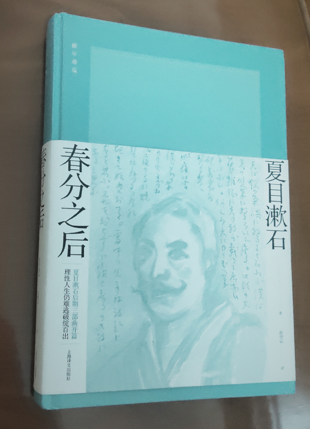

> 不知道这本书在说什么主题，但是阅读起来就是很有意思。也许作者并不打算就某一主题进行探讨，也许作者想把他感兴趣的一切都糅合进去聊聊，就像《我是猫》。总之这种风格我挺喜欢。
> 

看完《我是猫》和《后来的事》之后，我越来越喜欢夏目漱石的这种风格。对心理活动细致的描写、对生活平凡与不平凡的事情的灵活分析，当然还有不时出现的对当时总体社会环境的评价。最重要的是，读来让人有代入感，但又不会因此陷入焦虑。

因此那之后我又趁着双十一，一口气买了好几本夏目漱石，其中一本我先看完了，就是这本《春分之后》。本来半年前就能看完的，但是因为种种原因，最后几十页半年来一直没看，终于功亏一篑。最近这两个月（尤其是这周），才集中精力一口气看完。

总体上看，我不知道这本书在说什么主题，但是阅读起来就是很有意思。也许作者并不打算就某一主题进行探讨，也许作者想把他感兴趣的一切都糅合进去聊聊，就像《我是猫》。总之这种风格我挺喜欢。

但可能是原先在报纸上连载的缘故，为了吊足读者的胃口，夏目漱石一次可能只写一点点，反映到书上来说，就是整篇小说读起来不太连贯。故事被很不自然地切割到一个又一个短短的小节里面，真是让一百年后的读者又爱又恨。

---

和我看过的前两本夏目的书一样，人物并不多，不妨在这里直接把所有主要的登场人物都罗列出来：

- 敬太郎：“我”，大学毕业，为工作奔忙，内心渴望冒险
- 森本：原先和敬太郎住在同一公寓。阅历丰富，满是离奇的冒险经历，但是生活并不稳定。后来去了大连电气公园。给敬太郎留下了一个自己雕刻的蛇头竹制手杖。
- 须永市藏：敬太郎的好友，父亲留下了大量遗产，因此生活优渥，衣食无忧。之前在大学学习法律，未婚。胆怯，却可能又想探索。
- 须永的母亲：传统日本女性，了解繁琐的旧礼数。经典催婚角色。
- 田口：须永的姨丈，实业家。善于处理人际关系，却又喜欢作弄人，给了敬太郎一个工作。
- 松本：须永的舅舅。自称高等游民，虽然没有工作，但是生活依然没有经济压力。对社会颇有自己的思考。
- 千代子：田口的女儿。出生时田口随口答应了须永母亲的请求，同意把千代子嫁给须永。和须永算是“青梅竹马”，相互了解，但又过于了解。

之外还有若干纯粹推动情节的角色，就不一一在这里列出了。

看到我列出的角色简介，恐怕你也知道这本书总体上没什么新意，甚至可以看成是《后来的事》的重置版，只不过把几个角色的特征重组了一下，拆分到不同的人身上。总是有个怯懦者，有个无业奔波者，有个玩世不恭者，有个生活无忧但未婚的富家子，有个独立观察社会的“置身事外”者，有个八面玲珑的实业家。不过总体上虽然人设上显得有些重复，具体情节上还是有点意思的。

---

大体的情节很简单。

### 1

首先，故事从敬太郎和森本在澡堂相遇开始。敬太郎仰慕森本丰富而离奇的冒险经历，因此希望森本多说一些故事。过后不久森本也几次来敬太郎家里坐客，敬太郎也以酒会之，席间森本提到了去北海道做测绘的经历，说起大风、竹林、饥饿等等离奇的事情。在竹林时，森本取了一根竹子雕刻成了现在他手上的那把蛇头手杖。但奇怪的是，在那之后，火车站职员森本就再也没有出现过。房东见森本不来，问敬太郎也得不到任何消息，就准备处理掉森本屋里的东西抵房租。在这部分故事的最后，森本给敬太郎写了一封信，主要谈及房租和屋内财产的处理问题，但是也提到了他已经到了大连。

森本允许房东处理所有的屋内财产，唯独把那把手杖给了敬太郎。

我初看这书的时候还以为森本在故事中只是暂时离开，之后会再出现，于是满怀期待地一直往后翻。不过还真就没有后续了。这个角色的登场，可能主要是为了给出那把手杖（笑）。

### 2

接下来，敬太郎去找朋友须永了。前面也说了，由于父亲的阴功，须永母子二人的生活很是优渥，也很清静。工作也不必须永发愁，自有亲戚帮忙。但是须永本人不想做官，也不想做公司职员，至今还在家待业。敬太郎过后又来了几次须永家，其中一次看到了年轻女子的木屐，便心生好奇。

敬太郎想借用须永的关系，帮忙找个工作，说“什么工作都行”。须永联系了田口，田口也答应见敬太郎一面。结果到了约定时间，田口却因为家里客人还没走，正在下围棋为由，让敬太郎吃了闭门羹。敬太郎正想回去找须永吐槽，谁知道只有须永的母亲在家。须永的母亲是个传统的日本妇女，上来就讲起一套客套话，把敬太郎请到屋里，然后滔滔不绝地开始讲起来，也说起了他们的家事。

其实这里作者已经透露了须永家的大体情况，不过第一次阅读恐怕读者不会在意这么多细节，看下来只记得须永母亲说了田口有两个女儿，也就是须永的表妹。作者有意让读者把上次敬太郎看到的木屐和须永的表妹联系起来，但又没有给出证据，只是提出这一悬疑。须永的母亲最后打破田口给敬太郎古板的影响，说这个人喜欢耍宝，但是也比较稳重，让敬太郎不要着急，事情最后肯定会有个交待。

### 3

敬太郎带上手杖，最后见到了田口，田口听说敬太郎想做侦探，就给了他一个「跟踪」的任务。其实完全可能是田口现编的。不过敬太郎哪里知道，直接就照做了，某日几点到几点之间，某地电车站，等待一个穿黑礼服，额头上有痣的人。敬太郎于是就带上手杖去做任务了，内心觉得做这种事情不合道德，也不合常理，但是心理却比较渴望刺激。但是过了任务时间，那个人还是没有出现，倒是有个年轻女子在同一个位置和敬太郎一起等待。黑礼服的人过了很长时间才出现，和那个年轻女子一起取了西餐馆。

敬太郎一路跟踪，最后还是在雨中把黑礼服的人跟丢了。

几天之后找田口回报，田口像作弄傻子一样对待敬太郎，不过演的倒是很真。先是对敬太郎没有按时结束任务回来回报表示不满，然后问起黑礼服和年轻女子的关系。敬太郎不知道，也不敢乱说，田口于是就派他直接去找黑礼服的人询问。

敬太郎第一次没带手杖，结果又吃了闭门羹，理由是“下雨天不会客”。第二次带上了手杖，天气也是晴朗的，成功见到了松本，黑礼服的人就是松本。松本简直就是另一个须永，一样无业，生活也没有经济压力，不过松本已经结婚生子了。而车站那个年轻女子，就是田口的女儿千代子。松本提醒敬太郎被田口耍了，这是敬太郎才醒悟过来。

### 4

最后田口给敬太郎安排了工作，敬太郎和须永一家，特别是须永和千代子二人，也渐渐熟络起来。渐渐敬太郎从千代子口中得知了为什么松本下雨天不会客（当然，带着他的手杖）：松本最爱的小女儿死于雨天，而那天正好有客人来。

夏目漱石对于这些生活小事的描写实在是十分生动，也许他本人也经历过类似的事情，生活环境也和他的小说里类似，让人读来很有真实感，也更容易引发共鸣。

### 5

敬太郎之后又多次去须永家里，也越发对千代子和须永二人的关系感到好奇。正好有千代子婚事的传言，因此他带上了手杖去找须永。（结果须永说出了长长的一大段文字）

千代子出生的时候，田口半开玩笑地同意把千代子许配给须永。

须永的母亲之所以会提出请求，是因为须永并非她所生，而是女佣生的。为了家族血统、光宗耀祖，须永的母亲一心想让二人结为连理。

> ps. 难道和表妹结婚在日本这么普遍吗？安倍的家族也谱系看起来也怪怪的
> 

然而二人因为从小到大一直在一块，彼此之间没有距离感，须永反而不太愿意娶千代子。

以此为背景，须永说了一堆乱七八糟的二人往事。活泼又有大小姐气质的千代子，这种性格让须永又有感又无感。千代子有时也暗示须永可以娶她，甚至还留着须永小时候给千代子画的画。然而须永像是故意忽略这一信号，有意把事情往后拖，不想作出决断。

须永真的一点感觉都没有吗？也不是，心理上似乎一直认为他占有着千代子。一次须永和田口全家去海边玩，叫上了强壮而又风度翩翩的高木，千代子的潜在提亲者之一。此人让须永内心莫名心生嫉妒。然而须永又是那样的自卑懦弱，没等大家一起回东京，就自己先回了。海边度假归来之后，千代子到须永家住了一晚，甚至和须永母亲一起梳了发髻。那一晚须永完全没睡好。

须永的妒忌和焦躁，虽然没有直接表达，但千代子都看在眼里。但千代子有时却觉得自己不是须永喜欢的样子，探不清须永到底心理是爱还是不爱，两人就这样在离心力和向心力的作用下维持这一种不上不下的状态。

> 看到这里我真的心里有蚂蚁在爬，须永是真的废。须永和母亲的关系也很复杂，母亲自私又慈爱，让须永特别矛盾。
> 

### 6

敬太郎到这就退场了，接下来的“我”就变成了松本。说的也是写无关紧要、用来给故事一个结局的话。须永最后去旅行了，他和千代子的关系最后也没有结局。

青梅竹马这种关系没有办法维持，要么成为恋人，要么变成好久都联系不上几回的普通朋友，甚至形同陌路，绝无稳定的中间状态可言。

---

说实在的，看完这个故事我没有什么感觉，虽然我也随着情节起伏把自己置入故事中去，但是真的没有特别强烈的共鸣或是启发，就像是喝了一杯糖水，嘴里微微有点甜味，但却谈不上更深刻的感觉。

倒是有些无关紧要的细节让我感兴趣，比如敬太郎去算卦的过程，比如他们的生活日常和精神状态，但也就止于此了。也许作者就是喜欢把故事的种子培养成幼苗，读者也乐见之，至于什么主题，什么中心，什么主旨，早就溶解到故事当中去了，只不过味道很淡，说不清也道不明。
