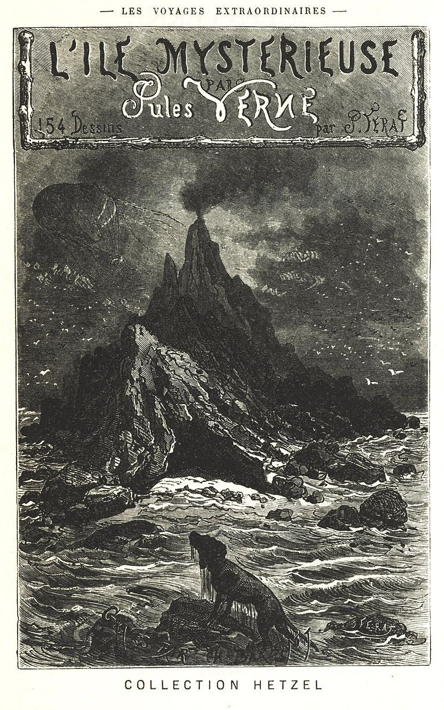
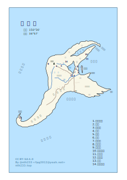
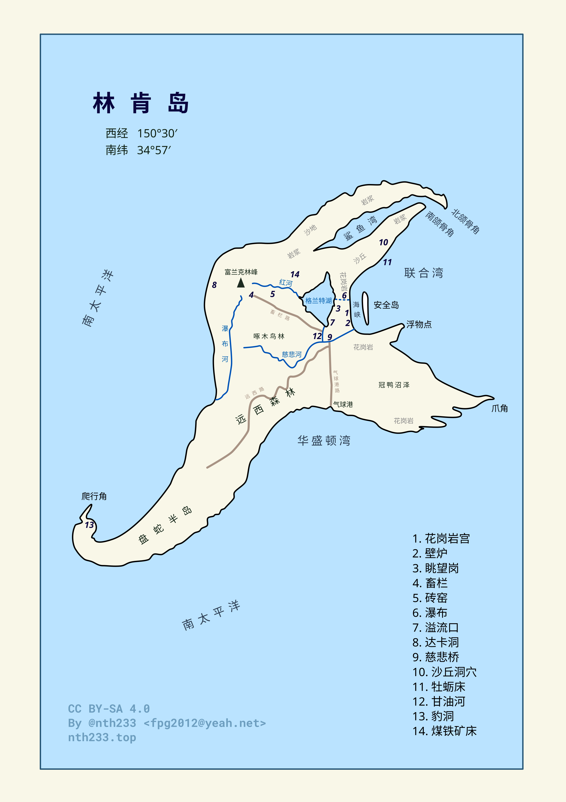
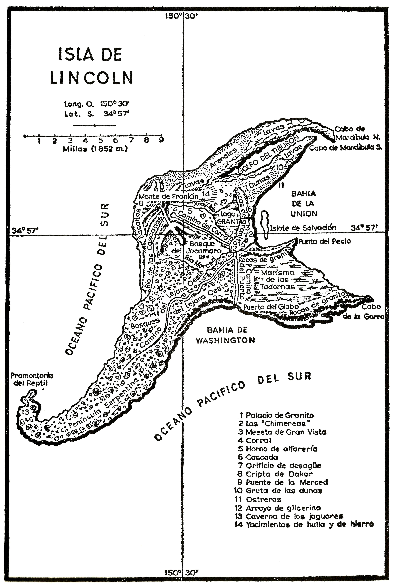

《神秘岛》是凡尔纳科幻三部曲（《格兰特船长的儿女》《海底两万里》《神秘岛》）的最后一部，出版时间最晚，剧情时间也最晚，为三部曲画上了一个精致的句号。在三部曲中，《神秘岛》的名气似乎远远不如《海底两万里》，也不如凡尔纳《气球上的五星期》《地心游记》等作品，有点可惜。我个人认为本作精彩程度不在《海底两万里》之下。

本书作者凡尔纳无需我多言——科幻小说的鼻祖。他写下的不少内容已经成为现实，但即使这样，我始终不觉得他的作品过时。每当翻开凡尔纳的小说，我总是能感受到鲜活的想象力、凡尔纳本人宏大的知识储备、以及蒸汽时代对新鲜事物的那种乐观精神。这种乐观精神是现在的小说所不具有的——就好比后世无法复刻唐诗的“盛唐气象”，要想感受这种乐观精神，只能到早期的科幻作品中体会了。凡尔纳始终是我最喜欢的科幻作家，我看的第一本科幻小说也正是凡尔纳的《海底两万里》。之后我把《海底两万里》读了一遍又一遍，小学时最终可能看了不下十遍，不敢说“常读常新”，但至少每次阅读都欣喜如初。

第一次阅读《神秘岛》大约是在小学五年级时，当时直接一口气从头读到了尾，早晨翻开，下午合上，就看完了。紧接着我又读了一两遍。当年我觉得《神秘岛》在三部曲中远胜《海底两万里》（最近读完之后我感觉并没有“远胜”）。在这种“童年滤镜”的加持之下，我今年2月又找了《神秘岛》的电子书放到了kindle上，想找回童年时的那种快乐。但这次断断续续到4月中旬才看完。

我认清了一个事实：我的心态发生了变化，周围环境也发生了变化，不再拥有童年时不断挖掘新鲜感的超能力了。这次阅读去掉了我的“童年滤镜”，让我觉得《神秘岛》没有以前那么精彩。但因为看得比较仔细，也整理出了一些以前没发现的信息。

本文本应于四月底完成（和三四郎的那篇同时），但因为完美主义强迫症（我想要重画出一张中文版的神秘岛地图），加上毕设/毕业等各种琐事缠身导致我缺少连续的自由时间，迟迟未能动笔，一直拖到了毕业回家之后才开始着手准备。现在离入职没剩几天了，决不能再拖延，否则又要和我的众多想法一样不了了之了。

## 人物简介

赛勒斯·史密斯：博学的工程师，完美体现“知行合一、经世致用”八个字，废奴主义者。主角团的带头者。【特长：博学多识的实干家】【性格：坚定、仁善、冷静】【马萨诸塞人】

纳布乔多诺索（简称纳布）：赛勒斯忠诚的仆人，先前是个黑奴，被赛勒斯解放。【特长：厨艺】【性格：天真】【马萨诸赛人】

热代尔·斯皮莱：《纽约先驱报》战地记者，曾为了第一时间向报社传回消息，占用电报线发《圣经》若干小时。【特长：速记、观察力】【性格：坚毅】

彭克罗夫：水手。常常起活跃气氛的作用。【特长：航海，健壮】【性格：急躁】【北方人】

哈伯·布朗：14岁少年，水手的船长留下的孤儿，具有博物学家的潜质。【特长：博物学】【性格：天真，坚强】【新泽西人】

托普：赛勒斯忠诚的爱犬，敏捷又聪慧。

艾尔通：《格兰特船长的儿女》中的人物，因背叛格兰特船长和格里那凡爵士等人被流放到塔波岛上悔罪。

## 情节梗概

故事开始于南北战争期间。赛勒斯作为北军参战，斯皮莱随北军报道，二人被俘于南方“首都”里士满，两人互相仰慕，相见恨晚。彭克罗夫和哈伯前往里士满办事，不料里士满被北军的李将军围困。纳布得知主人被俘，连夜从马萨诸撒潜入里士满。主角5人在里士满相会，密谋利用气球和风暴天气逃出被围困的里士满。

5人成功利用气球逃出了里士满，但不料风暴将他们带到了太平洋。气球坠毁时，5人正好到达一篇陆地。工程师之外的4人成功在**安全岛**下气球，赛勒斯被巨浪冲向北边，托普前去救援，也不知所踪。

4人相互扶持，成功找到一个庇护所和食物，度过了第一晚。第二天，众人尝试寻找赛勒斯，未果。第二晚，狂风交加，托普突然出现。众人跟随托普在**山洞**中找到赛勒斯。赛勒斯对自己在山洞中获救感到不解。

有了赛勒斯，众人在岛上的生活步入正轨，并逐渐有了归属感。先是在赛勒斯的带领下对岛屿进行了一番简单的勘探，登上岛上的**火山**，为岛屿上的各处地点和岛屿本身命名。然后从头干起：制砖、制陶、炼铁、制造硝化甘油炸药、搭建**花岗岩宫**住所、测算岛屿的位置、搭建**畜栏**、种植小麦、制衣、造船、狩猎、建磨坊、架电报。一切都十分顺利，每当众人陷入困境时，总会阴差阳错地得救。

众人收服了一只黑猩猩，命名为“于普”。众人在海上发现了一个箱子，里面是枪支、书籍、地图、工具等重要的补给。里面有本圣经，赛勒斯发现其中一句话被特地标注了：

> 只要祈求，便能得到；只要寻找，便能发现。
> 

在第二年，在船下水时**，**众人收到漂流瓶，告知临近的塔波岛有人。于是彭克罗夫等人驾“乘风破浪号”前往，带回已经如同野人的艾尔通。艾尔通已经悔罪，但仍然十分自责，不愿与5人交流，只是默默干活。

第三年，遭到海盗袭击，海盗船被神秘力量突然摧毁。部分海盗流落上岛，造成极大破坏，乘风破浪号被毁。众人一度处于险境，但屡屡得救。

第四年，赛勒斯终于知道了屡屡得救的原因——尼摩船长一直在暗处为他们保驾护航。林肯岛是鹦鹉螺号的休整点。在神秘岛第四年时，尼摩的同伴几乎已经悉数去世，潜艇也因地形改变的原因无法开出林肯岛水下了。尼摩获知岛上有5个善良、正直的人不幸落难于此，从一开始便暗中帮助，他时而跟踪，时而在花岗岩洞的深井里偷听，伸手众人品质的感动。临终前，尼摩船长通过电报，呼唤赛勒斯等人登上鹦鹉螺号。此时的尼摩船长已经奄奄一息、行将就木了。众人感激之余履行了尼摩的遗嘱：将鹦鹉螺号连同尼摩自己沉入深海。尼摩去世前密告赛勒斯，林肯岛随时可能沉没。

果然，不久后，火山爆发，岩浆改道。众人于是加紧造船工作，只可惜功亏一篑，在船只即将下水前，岛屿爆炸，摧毁了一切，只留下一块礁石，岛上生物连同于普在内全数死亡，6人侥幸存活。一天后，格里那凡爵士驾驶“邓肯号”前来，救走6人。于是6人登船后回到美国，用尼摩馈赠的财报在艾奥瓦州购置了一篇土地，命名为林肯岛。

> 史密斯等人在这儿非常幸福，他们仍旧像患难之时一样地团结一致。不过，他们谁都无法忘记那座海上孤岛。他们刚落在它上面时，什么都没有了，是地地道道的落难者，但是在整整四个年头中，是林肯岛保证了他们的生活所需。可是现在，原先的那座美丽的孤岛已不复存在，只是一块任由风吹浪打的花岗岩礁石，只是一个曾经名为尼摩船长的神秘人物的坟墓了。
> 

## 林肯岛地图

~~虽然已经在笔记本上画好了，但是最近暂时实在没有时间绘制成矢量图，干脆过后再补充。~~

由于林肯岛的中文地图很难找，所以我根据网上流传的地图[A](https://en.wikipedia.org/wiki/The_Mysterious_Island#/media/File:Ile_Mysterieuse_03.jpg)、[B](https://commons.wikimedia.org/wiki/Category:Maps_of_The_Mysterious_Island#/media/File:Isla_de_Lincoln.jpg)、[C](https://www.reddit.com/r/books/comments/1hcnfi/a_highdefinition_color_english_map_of_lincoln/)、[E](https://www.pinterest.com/pin/6966574416461437/)，重绘了一张中文的林肯岛地图。

如果有诸如字体错误等问题，可以查看[PNG版本](./map.png)

> 注：上面两张地图按照CC BY-SA 4.0协议共享，即转载时需标明出处（原作者署名），同时必须以相同方式共享。不限制对该作品的演绎和商用。
> 
>  This work is licensed under a <a rel="license" href="http://creativecommons.org/licenses/by-sa/4.0/">Creative Commons Attribution-ShareAlike 4.0 International License</a>.

我们可以对照一下原文：

> 该岛轮廓确实如此，知道这一点是很有必要的。记者所画之图十分精确。
>
> 海岸东部形成一个宽阔的海湾，遇险者们正是从这儿登上海岛的。东南尽头是一个突出的海角，东北方向另有两个海角围绕着海湾，两海角之间是一个海峡，看起来像狗鲨半张开的嘴。从东北到西北，海岸呈弧形，然后，地势逐渐走高，隆起。海岛中央就是火山。从这隆起处开始，海岸从南到北比较平直，在三分之二的地方有一条狭窄小河，把海岸割开。从这儿往南，海岸变得细长，犹如一条鳄鱼的尾巴。这条鳄鱼尾巴形成一个真正的半岛，从前面所说之东南角起，向大海中延伸有三十多英里，顶端弯曲，形成一宽阔锚地，是该岛的低海岸。它最窄的地方就是“壁炉”到与它同纬度的西海岸的小河，只有十英里，而其最长距离，亦即从东北的狗鲨嘴角到西南的尾端，有三十余英里。海岛内陆，从高山至海滨的整个南部地区，林木众多，而北部地区则干旱多沙地。在火山和东海岸之间，他们意外地发现了一个湖。湖边绿树环绕。从高处望去，此湖似与大海处于同一海拔高度，但工程师略加考虑，认为海拔高度有三百英尺，因为它处于海岸高地的延伸部分。
>
> “这是淡水湖吗？”水手问。
> 
> “应该是的，”工程师回答，“湖水是从山里流出来的。”
> 
> “看呀！有一条小河流进湖里。”哈伯指着一条小溪说。小溪显然是从西面山梁支脉流下来的。
> 
> “既然这条小溪向湖里供水，”工程师说，“那么，靠海的地方就一定有一个溢流口，湖水太满时，可以从口子溢出。我们返回时可以去看一看。”
>
> 这条小溪与前面所说的那条河形成小岛的水系。但占该岛三分之二面积的森林下面，可能也有河流流入大海，这是根据此处长有那么多的温带植物而做出的判断。在海岛北部，似无河水。位于东北部的沼泽地也许有一些死水。此外，沙丘、沙滩和显而易见的干旱与岛上大部分地区的草肥林美形成强烈的反差。
> 
> 火山没在岛中心，而是立于西北部，好似两个地区的分水岭。在西南、正南和东南，山梁支脉末端为青翠草木所掩映，但在北边，山的分支明显地延伸到海滩。火山喷发时，熔岩从这儿流过，形成一条宽阔的熔岩流，直伸至形成东北海湾的峡口。他们在火山顶上观察了足足有一个钟头。呈现在他们面前的海岛色彩斑斓，绿绿的森林、黄黄的沙地、蓝蓝的海水。他们对海岛的概貌已基本有数了。
> 
> 现在，还有一个重要问题必须弄清：岛上有人吗？他们没见任何地方有人的痕迹：没见幢幢房舍，没见孤立小屋，没见渔场，没见炊烟。
> 
> 
> ……
> 
> “我看这样吧，”史密斯见大家你一言我一语地取了不少名字，最后说道，“我们把东面的那个大海湾叫作‘联合湾’，把南面的那个叫作‘华盛顿湾’，把我们现在所在的山称作‘富兰克林山’，山下的那个湖叫‘格兰特湖’……这些名字能让我们想起我们的国家以及那些为国增光的伟大公民。有些地方可以根据地形来取名，尚待发现的地方，以后随时再取，大家意下如何？”史密斯的建议得到朋友们的一致赞同。于是，大家又你一言我一语地把伸向西南边的半岛称作“盘蛇半岛”，末端的弯弯的尾巴称作“爬虫角”；把另一端的海湾称作“鲨鱼湾”，把“鲨鱼”的嘴部称作“颌骨角”，因为有两个海角，故而分别称作“北颌骨角”和“南颌骨角”；把东南边的海角，也就是联合湾的顶端称作“爪角”，而那条为大家提供淡水的河被称作“慈悲河”；这些遇险者最初着陆的那个小岛被称作“安全岛”；“壁炉”上方高耸着的花岗岩峭壁，顶端是一高地，可以对整个大海湾一览无余，所以被称作“眺望岗”；覆盖整个盘蛇半岛的密林被称作“远西森林”。
>
>  命名工作暂告一段落，斯皮莱一一记在他的笔记本上。
>
> 至于海岛的方位，工程师打算等准确地测定了海岛的正北方向之后，再做记录。
> 
> 一切都弄完了，众人正待走下富兰克林山返回“壁炉”，突然彭克罗夫大声嚷道：“啊，怎么搞的！我们怎么把我们的岛给忘了，没给它取个名字！”哈伯正想建议以史密斯先生的名字为之命名，可工程师立即表示道：“朋友们，我们就用一位伟大的公民的名字来命名它吧。此人现在正在为保卫美利坚合众国的统一而斗争，所以我们就把我们的这个岛称为‘林肯岛’吧！”
> 

## 时间线整理

我在整理时间线时发现有几处矛盾，可能时翻译问题，也有可能是电子书制作时的错误，不排除凡尔纳原作就是这样的，我没有验证。

| 年份 | 日期 | 事件 | 备注 |
| --- | --- | --- | --- |
| 1865 | 3.20 | 逃离里士满 |  |
|  | 3.23 | 气球在大洋上空漏气 |  |
|  | 3.25 | 到达林肯岛 |  |
|  | 3.26夜 | 找到赛勒斯 |  |
|  | 3.29暮 | 赛勒斯判断处于小岛 |  |
|  | 3.30晨 | 确认处于小岛 |  |
|  | 4.6 | 制砖 |  |
|  | 4.15 | 制陶 | 林肯遇刺 |
|  | 4.16 | 复活节，完成岛的定位 |  |
|  | 4.17 | 炼铁准备 |  |
|  | 4.20 | 采矿 |  |
|  | 4.21 | 得到生铁 |  |
|  | 4.25 | 得到铁锭，制成铁器 |  |
|  | 5.5 | 冶金终止 |  |
|  | 5.7 | 找到格兰特湖溢流口 |  |
|  | 5.8 | 着手制作炸药 |  |
|  | 5.18 | 制得硫化铁等物质 |  |
|  | 5.20 | 制得硝酸和硝化甘油 |  |
|  | 5.21 | 炸开瀑布，格兰特湖水面下降，溢流口露出 |  |
|  | 5.22 | 入住花岗岩宫 |  |
|  | 6.29 | 气温骤降，入冬 |  |
|  | 7.5 | 慈悲河封冻 |  |
|  | 8.15 | 暴雪 |  |
|  | 8月底 | 暂时转暖，发现猫科动物踪迹。炼糖 |  |
|  | 10.24 | 捕获野猪，但是小野猪里有子弹 |  |
|  | 10.29 | 小船下水，发现尼摩的补给 |  |
|  | 10.31 | 到达瀑布河口，发现竹子 |  |
|  | 11.1 | 找到气球残骸，位置命名为气球港 |  |
|  | 11.2 | 回到花岗岩宫，发现被猴子占领，收服于普 |  |
|  | 11.20 | 慈悲桥完工，收麦 |  |
|  | 11.21 | 开凿甘油河 |  |
|  | 12.23 | 收服野驴 |  |
| 1866 | 3.14 | “周年” | 此处时间线有误 |
|  | 3.17 | 水里升降机投用 |  |
|  | 3.28 | 吹制玻璃器皿 |  |
|  | 4.1 | 意识到塔波岛存在，决心造船 |  |
|  | 4.15 | 第二季收麦 |  |
|  | 5.1 | 发现烟草 |  |
|  | 5.30 | 彭克罗夫终于抽到烟 |  |
|  | 6.20 | 入冬，造船中止 |  |
|  | 6.30 | 信天翁到达，用于送信 |  |
|  | 8.3 | 工程师下花岗岩宫的井，但没有发现异常 |  |
|  | 8.12 | 狐狸袭击，于普受伤 |  |
|  | 9.15 | 船甲板完工 |  |
|  | 10.10 | 新船下水，命名为“乘风破浪号”，发现漂流瓶，得知塔波岛上有人 |  |
|  | 10.13 | 斯、彭、哈三人抵塔波岛 |  |
|  | 10.20 | 哈伯遭到艾尔通袭击 |  |
|  | 10.18夜 | 三人迷失方向前，尼摩点亮篝火引路 |  |
|  | 11.3 | 艾尔通终于开口 |  |
|  | 11.15 | 第三季小麦 |  |
|  | 12.1 | 风磨完工，得到面粉 |  |
|  | 12.20 | 艾尔通入住畜栏新居 |  |
| 1867 | 2.12 | 电报机落成 |  |
|  | 4.25 | 工程师盘点岛上怪事 |  |
|  | 10.17 | 遭到海盗袭击 |  |
|  | 10.18 | 海盗船神秘沉没 |  |
|  | 10.19-10.20 | 收拾沉船物资 |  |
|  | 11.6 | 阿龙纳克斯登船 | 《海底两万里》* |
|  | 11.8 | 炮台完工 |  |
|  | 11.11 | 夺回畜栏，哈伯中弹，被围困 |  |
|  | 11.29 | 敌人占领眺望岗 |  |
|  | 12.6 | 哈伯高烧 |  |
|  | 12.8 | 尼摩送奎宁 | 冲突 |
| 1868 | 2.19 | 尼摩救艾尔通。工程师基本确认了保护者的存在 | 冲突 |
|  | 2.25 | 返回花岗岩宫 |  |
|  | 3.25 | 三周年 |  |
|  | 5.15 | 船龙骨完工 |  |
|  | 6.10 | 入冬，终止造船 |  |
|  | 8月 | 阿龙纳克斯离开鹦鹉螺号 | 《海底两万里》* |
|  | 9.7 | 火山首次出现爆发迹象 |  |
|  | 10.15 | 尼摩发电报。发现达卡洞，见到尼摩 |  |
|  | 10.16 | 尼摩逝世，随鹦鹉螺号沉入深海 |  |
| 1869 | 1.3 | 火山喷发 |  |
|  | 1.8 | 工程师确认林肯岛将消失 |  |
|  | 1.23 | 火山剧烈喷发。船甲板尚未完工 |  |
|  | 3.3 | 船几乎完工，再过10余天便可下水 |  |
|  | 3.8 | 众人登船（未完工），林肯岛毁灭 |  |
|  | 3.24 | 邓肯号到达，众人得救 |  |

*稍加验证就能知道，海底两万里和神秘岛的时间线是冲突的，因为尼摩和鹦鹉螺号同时出现在两处。如果把海底两万里的时间整体往前挪一年，似乎可以避免时间上的冲突。或者说……有两个尼摩船长、两艘鹦鹉螺号？总结一下有几种可能性：

1. 凡尔纳搞错了时间线
2. 尼摩船长和鹦鹉螺号有两个
3. 送奎宁、救艾尔通的人不是尼摩

我倾向于认为是第一种情况——凡尔纳或者其出版商搞错了时间线。

## 神秘岛为何“神秘”

书名叫做神秘岛，但我童年阅读时始终不觉得神秘岛对5人主角团来说有多神秘。在赛勒斯的带领下，神秘岛几乎没有什么秘密可言，他们详细地勘探了岛屿，也推测了岛屿的成因，测定了岛屿的位置，最后还见到了尼摩船长。在博学的赛勒斯看来，神秘岛的一切自然现象似乎都有合理的科学解释，没有什么神秘之处。

但其实凡尔纳特意留了一条线索，只不过我以前一直没有注意。凡尔纳特意突出了众人经历中的一些特殊事件，特地强调了他们在千钧一发之时得救的经历。神秘的不是这个不在地图上标注的无人岛，而是尼摩船长在暗处的种种支援。尼摩做了这些事情，在5人眼里看起来仿佛像是上帝显灵：

1. 把赛勒斯救到山洞里
2. 托普下水捕捉儒艮时用水流托起托普，托普此时已经知道尼摩船长的存在了
3. 在花岗岩宫的井底偷听众人的谈话，被托普和于普发现
4. 在小船下水时送来一箱物资，并且在圣经上标注了“只要祈求，便能得到；只要寻找，便能发现。”这句话
5. 在花岗岩宫被猴子占领时，帮忙放下绳梯
6. 帮助众人打猎，把子弹打进小猪体内
7. 在大船下水时送来漂流瓶
8. 在斯皮莱、彭克罗夫、哈伯三人返航时点亮篝火引路
9. 布置水雷炸沉海盗船
10. 在众人被围困、哈伯高烧时送来救命的奎宁
11. 在艾尔通被囚禁昏迷的时候解救艾尔通，杀害海盗，把艾尔通送回畜栏

在尼摩终于无法掩饰自己的存在时，他接通了达卡洞到畜栏的电报线，告知史密斯火山即将爆发、毁灭林肯岛的重要信息。尼摩还悄悄前往塔波岛，写好一封信，以便格里那凡等人能够及时赶往林肯岛，到生命终结后仍然在保护这些落难者。

工程师赛勒斯虽然信教，但是绝不迷信神秘力量，也不愿意轻信“奇迹”的发生，他骨子里认为所有的现象都应该有合理的科学解释，对他而言林肯岛的神秘不在于自然现象，而在于神秘“守护神”的存在。凡尔纳行文中多次强调工程师的疑虑，不断提示尼摩船长这一条暗线，这才是神秘岛的神秘之处。

尼摩的存在让整个故事性质发生了微妙的变化。我原本以为神秘岛是一群人从头干起，从什么也没有到自给自足。但事实并非如此，如果没有尼摩船长在背后暗中支援、暗中引导，赛勒斯一行人根本无法在神秘岛生存。说到底，众人能够在林肯岛站稳脚跟，虽然自力更生十分重要，但归根结底靠的还是运气和尼摩的恩惠——这让整个故事变得更加合理，但不那么振奋人心了。神秘岛丰饶的物产以及赛勒斯的博学为尼摩最大限度地隐身提供了条件，尼摩不需要像《海底两万里》里面那样直接出面相救，他只需要给予少量必要的援助，就可以拯救赛勒斯等人的命运。

## 杂谈

### 尼摩船长

从《海底两万里》到《神秘岛》，我想尼摩船长代表了凡尔纳或出版商的某种立场：同情殖民地人民受压迫的命运，反对奴役，崇尚自由平等。

尼摩船长本是印度达卡王子，具有秘密造出鹦鹉螺号这样的潜艇所需的资金、知识、人力等条件。因为祖国始终在英国人的压迫之下，反抗不成，便转入海洋。海洋是尼摩对人世失望后的最后归宿，因为海洋深处不会有暴君，不会有暴行和压迫。

尼摩极少发怒，似乎只在《海底两万里》中有一次：他那时以复仇的心态驾驶潜艇摧毁了“某国”的军舰（凡尔纳起初写是哪国的军舰，可能是为了避免引发不必要的争议，在《神秘岛》中才写明了是英国的军舰）。尼摩一向竭力为善，这次正当防卫后，尼摩或许也多少感到不安，所以在《神秘岛》中才会向赛勒斯等人询问众人对自己的评价。即使表面上看起来坚定，但他或许也开始怀疑自己的选择是否正确了。

> 他将双手伸向空中，喃喃地说：“我到底是对还是错呀？”
> 

赛勒斯没有直接回答，只是再次表达了自己的感激之情。

我认为尼摩完全没有必要怀疑自己，他根本没有必要在意世人的看法。他选择与世隔绝，人类的正义与非正义在属于尼摩的深海中已经没有意义了。他选择与世隔绝并非是为了复仇，而是为了追寻一个真正自由、没有奴役、没有殖民者的国度。如果非要说，我觉得尼摩是正义的。不管怎么样，尼摩带走他的一切沉入了他热爱的深海，至于后面的是是非非，全留给世人讨论。

凡尔纳反对奴役的立场在另一处也可以明显地体现出来：行文的前前后后，他始终表现出对林肯代表的北军的崇敬，以至于还在时间线中突出了林肯遇刺的那一天。

### 五人核心

《神秘岛》和《鲁滨逊漂流记》最明显的区别在于人数。《神秘岛》涉及到5个核心人物，而《鲁滨逊》只有两个，这使得《神秘岛》里的主角们可以走得更远。《神秘岛》中众人以及于普和托普始终保持着通力合作和民主决策，没有明显的主奴划分，而《鲁滨逊》就不一样了——我总感觉《鲁滨逊》还带着点奴隶制的古旧味道，《神秘岛》则进步得多。

### 题外话

断断续续两个月下来，才勉强写完本文，并且最后成文我个人不太满意，没能把我所有的感受和想法都整合进来。
