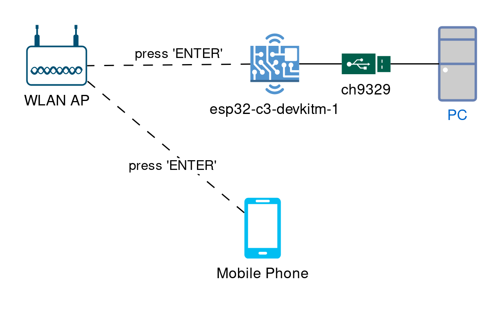
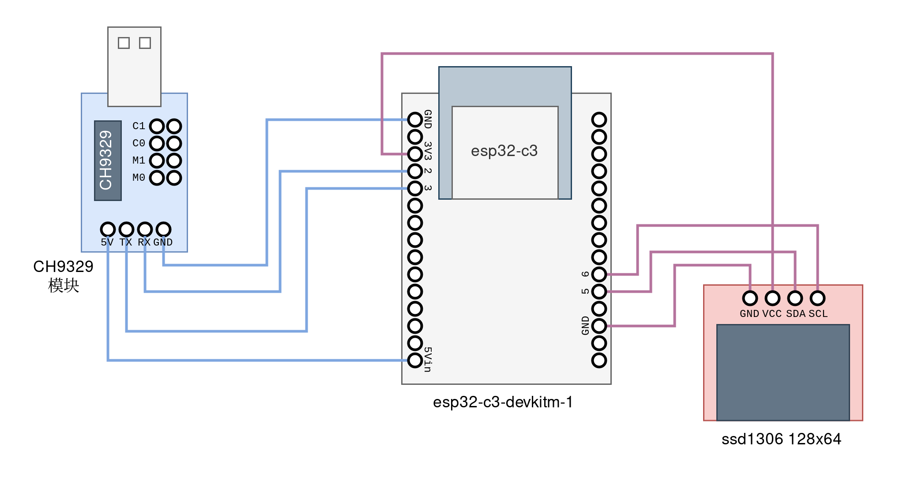

蓝牙键盘鼠标有很多优点，不需要线，也不需要占用一个USB接口，有些键盘还可以多模匹配，切换设备只需要按一个键。但有一个缺点是蓝牙键盘避不开的：必须在操作系统启动之后才能使用。

这就带来一个棘手的问题：在GRUB以及BIOS中，没有办法使用蓝牙键盘鼠标。于是在我换蓝牙键盘之后，还是不得不常备一个有线键盘或者2.4GHz的无线键盘——直接把蓝牙键盘的种种好处都抵消掉了。如果手边恰好没有有线键盘/2.4GHz无线键盘，那我就无法在开机选操作系统。

因此我做了这个东西进行补救：基于esp32-c3的网络控制键盘（下文直接称为esp32键盘）。

## 工作方式



大概就是esp32-c3经由ch9329串口转USB HID模块，连接到主机上，在主机看来，esp32-c3就是个USB键鼠。esp32-c3同时也连接到本地的WiFi，并且运行一个HTTP服务端。访问它会返回一个网页，网页中有若干按钮，按下网页上的按钮时会给esp32-c3发请求。esp32-c3解析请求后，通过ch9329模拟键盘按下那个键。

有了这个esp32键盘之后，我就可以通过手机模拟一个USB键盘的操作，从而在GRUB界面里面选操作系统，无需常备一块有线键盘。

## 材料

1. esp32-c3-devkitm-1（某宝随便买的）
2. ch9329模块（某宝随便买的）
3. ssd1306 128x64的显示屏（很久以前某宝买的）（可选）
4. 杜邦线若干

## 用到的库

1. 参照乐鑫官网配好Arduino IDE（也就是安装esp32开发板）
2. 在Arduino IDE安装u8g2库，用来操作显示屏（可选）
3. 在Arduino IDE安装CH9219_Keyboard库

## 导线连接

如图所示



## 代码

```c++
#include <WiFi.h>
#include <WiFiClient.h>
#include <WebServer.h>
#include <uri/UriBraces.h>

#include <Arduino.h>
#include <U8g2lib.h>

#ifdef U8X8_HAVE_HW_SPI
#include <SPI.h>
#endif
#ifdef U8X8_HAVE_HW_I2C
#include <Wire.h>
#endif

#include "CH9329_Keyboard.h"

#define WIFI_SSID "你的WiFi名(SSID)"
#define WIFI_PASSWORD "你的WiFi密码"
// Defining the WiFi channel speeds up the connection:
#define WIFI_CHANNEL 6

U8G2_SSD1306_128X64_NONAME_F_HW_I2C u8g2(U8G2_R0, /* reset=*/ U8X8_PIN_NONE, /* clock=*/ 6, /* data=*/ 5);

WebServer server(80);
const int press_up = 1, press_down = 2, press_right = 3, press_left = 4, press_enter = 5;
#define QUEUE_SIZE 7
int press_history_queue[QUEUE_SIZE] = {-1, -1, -1, -1, -1};
int p_front = 0, p_rear = 0;
int queue_len = 0;
char queue_str[QUEUE_SIZE + 3];
char queue_str_map[] = {'0', 'U', 'D', 'L', 'R', 'E'};

int position_x = 0, position_y = 0;

uint64_t counter_default = 4096;
uint64_t counter = counter_default;

uint64_t counter_close_display_default = 32768;
uint64_t counter_close_display = counter_close_display_default;

uint64_t cycles = 0;
int real_cycles = 0;

void pop_queue() {
  if (queue_len == 0) {
    return;
  }
  p_front = (p_front + 1) % QUEUE_SIZE;
  queue_len --;
}

void push_queue(int item) {
  if (queue_len == QUEUE_SIZE) {
    pop_queue();
  }
  press_history_queue[p_rear] = item;
  p_rear = (p_rear + 1) % QUEUE_SIZE;
  queue_len ++;
}

void update_queue_str() {
  int i = 0;
  for (i = 0; i < queue_len; ++i) {
    queue_str[i] = queue_str_map[press_history_queue[(p_front + i) % QUEUE_SIZE]];
  }
  queue_str[i] = '\n';
}

void update_position() {
  position_x = (position_x + 1) % (20);
  position_y = (position_y + 1) % (30);
  updateDisplay();
}

void updateDisplay() {
  u8g2.clearBuffer();					// clear the internal memory
  u8g2.setFont(u8g2_font_t0_15b_tn);	// choose a suitable font
  u8g2.drawStr(position_x,position_y+10, WiFi.localIP().toString().c_str());	// write something to the internal memory
  
  String cycles_str = String("LOOP/1024=") + String(cycles);
  u8g2.setFont(u8g2_font_chikita_tr);
  u8g2.drawStr(position_x, position_y+17, cycles_str.c_str());
  u8g2.setFont(u8g2_font_tenstamps_mf);	// choose a suitable font
  u8g2.drawStr(position_x,position_y+34, queue_str);	// write something to the internal memory
  u8g2.sendBuffer();					// transfer internal memory to the display
}

void closeDisplay() {
  u8g2.clearBuffer();
  u8g2.sendBuffer();
}

void sendHtml() {
  String response = R"(
    <!DOCTYPE html><html>
      <head>
        <title>ESP32 Web Server Demo</title>
        <meta name="viewport" content="width=device-width, initial-scale=1">
        <style>
          html { font-family: sans-serif; text-align: center; width: 100vw; }
          body { display: inline-flex; flex-direction: column; }
          h1 { margin-bottom: 1.2em; } 
          h2 { margin: 0; }
          div { display: flex; flex-wrap: wrap; }
          .btn { background-color: #5B5; border: none; color: #fff; padding: 0.5em 1em;
                 font-size: 2em; text-decoration: none; margin: 0.5em; }
          .btn.OFF { background-color: #333; }
          }
        </style>
      </head>
            
      <body>
        <h1>ESP32 Web Server</h1>

        <div class="button-area">
          <span id="up" class="btn">up</span>
          <span id="down" class="btn">down</span>
          <span id="left" class="btn">left</span>
          <span id="right" class="btn">right</span>
          <span id="enter" class="btn">ENTER</span>
        </div>
        <script>
          var up = document.getElementById("up");
          var down = document.getElementById("down");
          var right = document.getElementById("right");
          var left = document.getElementById("left");
          var enter = document.getElementById("enter");

          up.onclick = async function() {
            await fetch("/press/1");
          }
          down.onclick = async function() {
            await fetch("/press/2");
          }
          right.onclick = async function() {
            await fetch("/press/3");
          }
          left.onclick = async function() {
            await fetch("/press/4");
          }
          enter.onclick = async function() {
            await fetch("/press/5");
          }
        </script>
      </body>
    </html>
  )";
  server.send(200, "text/html", response);
  
}

void setup(void) {

  Serial.begin(115200);
  Serial1.begin(9600, SERIAL_8N1, 3, 2);
  CH9329_Keyboard.begin(Serial1);

  WiFi.begin(WIFI_SSID, WIFI_PASSWORD, WIFI_CHANNEL);
  Serial.print("Connecting to WiFi ");
  Serial.print(WIFI_SSID);
  // Wait for connection
  while (WiFi.status() != WL_CONNECTED) {
    delay(100);
    Serial.print(".");
  }
  Serial.println(" Connected!");

  Serial.print("IP address: ");
  Serial.println(WiFi.localIP());

  server.on("/", sendHtml);

  server.on(UriBraces("/press/{}"), []() {
    String press_button = server.pathArg(0);
    Serial.print("Press #");
    Serial.println(press_button);

    switch (press_button.toInt()) {
      case 1:
        // up
        CH9329_Keyboard.press(KEY_UP_ARROW);
        break;
      case 2:
        // down
        CH9329_Keyboard.press(KEY_DOWN_ARROW);
        break;
      case 3:
        // right
        CH9329_Keyboard.press(KEY_RIGHT_ARROW);
        break;
      case 4:
        // left
        CH9329_Keyboard.press(KEY_LEFT_ARROW);
        break;
      case 5:
        // enter
        CH9329_Keyboard.press(KEY_RETURN);
        break;
    }
    push_queue(press_button.toInt());
    update_queue_str();
    updateDisplay();

    Serial.println(queue_str);

    server.send(200);
    CH9329_Keyboard.releaseAll();

    counter_close_display = 32768;
  });

  server.begin();
  u8g2.begin();
  Serial.println("HTTP server started");
  updateDisplay();
}

void loop(void) {
  server.handleClient();
  delay(2);
  real_cycles = (real_cycles + 1) % 1024;
  if (real_cycles == 1023) {
    cycles++;
  }
  if (counter > 0) {
    counter--;
  } else {
    counter = counter_default;
    update_position();
  }
  if (counter_close_display > 0) {
    counter_close_display--;
  } else {
    closeDisplay();
  }
}
```

> 注：显示屏只是为了方便看IP地址。如果你不需要显示屏，就把u8g2相关的东西全部删掉

> 注2：记得把WiFi名（SSID）和密码换成自己的

## 结果

<div style="display: grid; gap: 10px; grid-template-columns: 1.16fr 1fr; grid-template-rows: 1fr 1fr;"></div>

## 参考

- [wokwi上的esp32HTTP服务器示例](https://wokwi.com/projects/320964045035274834)
- [u8g2](https://github.com/olikraus/u8g2/wiki)
- [CH9329_Keyboard (by shigobu)](https://github.com/shigobu/CH9329_Keyboard)
- [esp32-c3-devkitm-1文档](https://docs.espressif.com/projects/esp-idf/zh_CN/latest/esp32c3/hw-reference/esp32c3/user-guide-devkitm-1.html)
