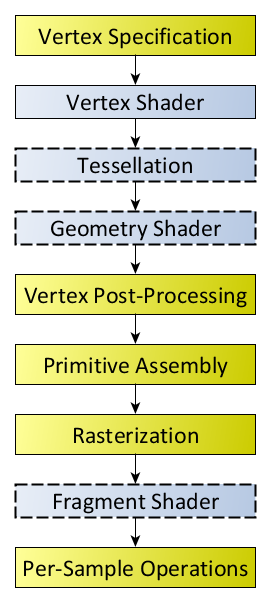
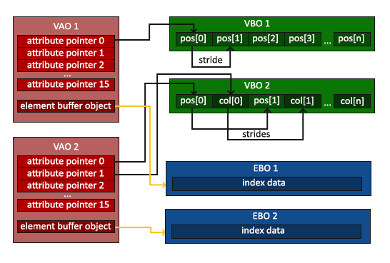
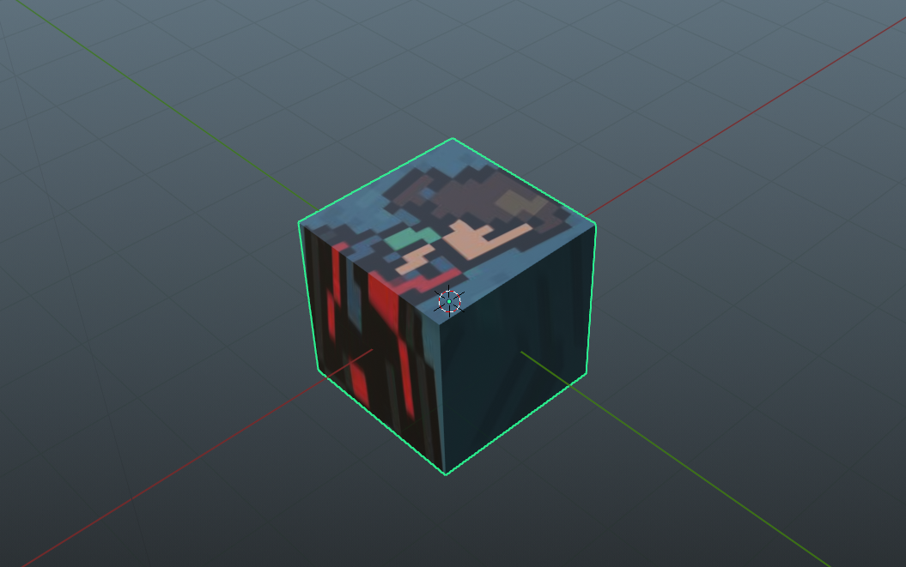
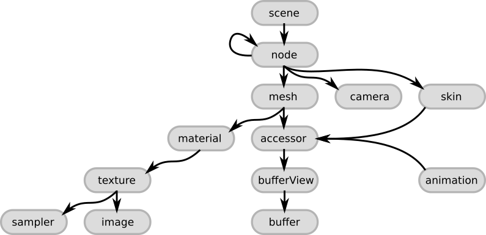
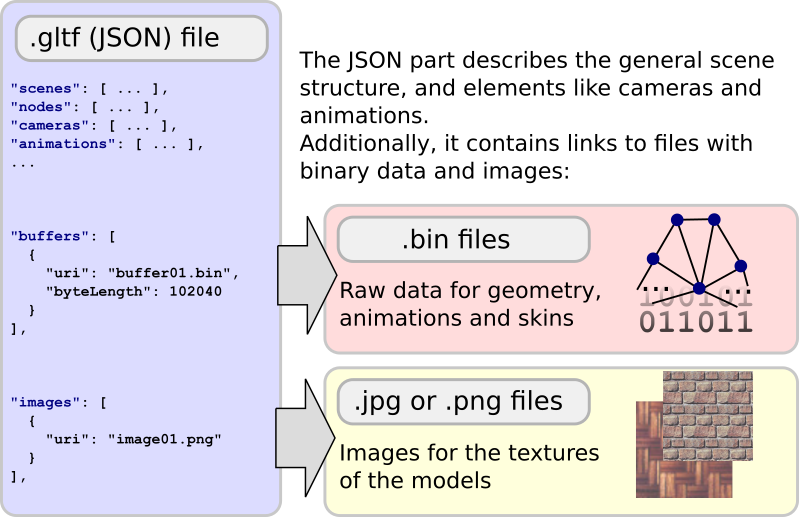

最近一时兴起，决定复习一下OpenGL。打算用一周的时间“速通”一下OpenGL（指画三角形、实现MVP变换、实现PCSS软阴影到到加载glTF模型）。之前过一遍Vulkan Tutorial的时候，一直想把sketchfab上面的模型加载进来，可惜当时搞不明白glTF的格式，网上现成的资料也不是太多。

这次一周快速复习OpenGL对我来说还是有点挑战。好在我确实一周内搞出来的，中间卡关了几次都是因为某些智障错误。

本文主要关注加载基本的glTF模型，不会涉及阴影。最终效果如下。


## 前置知识

### OpenGL基础知识

如果已经熟悉OpenGL，请直接跳到GLTF文件格式一节。一下内容建议结合LearnOpenGL阅读。

#### 概述

加载3D模型，归根到底就是在绘制一系列三角形。给定每一个三角形顶点的位置、顶点对应的纹理坐标、顶点对应的法向量，剩下的就交给OpenGL和GPU的渲染管线。管线的一端是我们传进去的顶点信息，另一端出来的就是绘制的结果。



[OpenGL的渲染管线](https://www.khronos.org/opengl/wiki/Rendering_Pipeline_Overview)环节有很多（图来自[Khronos的wiki](https://www.khronos.org/opengl/wiki/Rendering_Pipeline_Overview)）。不过简单起见，我们认为输入顶点的数据经过简单处理，会传递给顶点着色器❲Vertex Shader❳。顶点着色器的输出在光栅化后，又传给片元着色器❲Fragment Shader❳，最后经过模板测试、深度测试和混合，写入帧缓冲❲Framebuffer❳。渲染的结果会通过交换链❲Swapchain❳被交换到屏幕上显示出来。

在渲染管线开始前，我们需要把数据从内存传递到GPU。这部分需要在显存创建缓冲区，并往里面填上数据。还需要对数据的格式（长度、类型、步长等等）进行解释。

在顶点着色器的阶段，GPU会对每个顶点调用一次顶点着色器的程序。经过差值和光栅化之后，在片元着色器的阶段，GPU会对每一个片元❲Fragment❳（可以理解为像素）调用一次片元着色器。这两个着色器都需要我们自己编写。着色程序涉及的一些统一的参数（比如变换矩阵、光源位置等等）需要通过`uniform`变量来传递。

所有东西都准备好后，调用一次画图函数（`glDrawElements`等）就能将所需的三角形绘制出来。我们经常用一个draw call绘制大量的三角形，以提高效率。

当然，这一切开始之前，还要创建一个窗口，并且初始化OpenGL上下文，这部分由GLFW代劳。

#### 缓冲

这里有必要展开说一下缓冲。缓冲可以大致分成两种，一种存储顶点的数据，也就是前面提到的位置、纹理坐标、法向量等等，称为顶点缓冲❲Vertex Buffer❳。另一种则是存顶点的索引，称为索引缓冲❲Index Buffer❳。引入顶点索引目的主要是为了省空间。考虑到复杂的模型可能有不少顶点同时被用于多个三角形，如果画图的时候每画一个三角形，就要给出顶点的全部数据，这些重复顶点的数据就会在涉及的每个三角形里重复一次，十分浪费空间。使用顶点索引后，绘制三角形不再需要三个顶点的全部数据，而只需要给出三个顶点的索引，GPU根据这些索引去顶点数据里面查相应顶点的数据，这样就能节约很多空间。

每次调用画图函数，OpenGL都需要知道当前的顶点缓冲，以及顶点缓冲内数据的存储格式。OpenGL把这些信息打包起来，和顶点数组对象❲Vertex Array Object，简称VAO❳关联起来。每次画图时，我们只要绑定创建好的VAO（如果要使用索引，还要绑定索引缓冲对象），调用draw call即可。

那么如何把顶点缓冲的结构和VAO关联起来呢？我们只需要在创建对应的VAO之后，绑定对应属性（比如顶点位置）所在的顶点缓冲，然后调用`glVertexAttribPointer`，告知类型、长度、步长、偏移等信息（图来自[LearnOpenGL](https://learnopengl.com/Getting-started/Hello-Triangle)）。



### glTF文件格式

> glTF™ is a royalty-free specification for the efficient transmission and loading of 3D scenes and models by engines and applications. glTF minimizes the size of 3D assets, and the runtime processing needed to unpack and use them.

本节建议参考[glTF spec](https://registry.khronos.org/glTF/specs/2.0/glTF-2.0.html)。

#### 基本概念

glTF是Khronos提出的一种3D内容格式，可以支持3D模型、3D动画，不过本文不会涉及和动画有关的内容，也不会涉及PBR材质。SketchFab上的模型都提供`.glb`或`.gltf`格式下载。

glTF格式是基于JSON的，下面是一个简单的示例，请仔细浏览一遍。

```json
{
	"scene":0,
	"scenes":[
		{
			"name":"Scene",
			"nodes":[
				0
			]
		}
	],
	"nodes":[
		{
			"mesh":0,
			"name":"Cube",
			"rotation":[
				-0.5065690875053406,
				-0.4970885217189789,
				0.49341458082199097,
				0.5028250217437744
			]
		}
	],
	"materials":[
		{
			"doubleSided":true,
			"name":"Material.001",
			"pbrMetallicRoughness":{
				"baseColorTexture":{
					"index":0
				},
				"metallicFactor":0,
				"roughnessFactor":0.5
			}
		}
	],
	"meshes":[
		{
			"name":"Cube",
			"primitives":[
				{
					"attributes":{
						"POSITION":0,
						"NORMAL":1,
						"TEXCOORD_0":2
					},
					"indices":3,
					"material":0
				}
			]
		}
	],
	"textures":[
		{
			"sampler":0,
			"source":0
		}
	],
	"images":[
		{
			"mimeType":"image/jpeg",
			"name":"avatar",
			"uri":"avatar.jpg"
		}
	],
	"accessors":[
		{
			"bufferView":0,
			"componentType":5126,
			"count":24,
			"max":[
				1,
				1,
				1
			],
			"min":[
				-1,
				-1,
				-1
			],
			"type":"VEC3"
		},
		{
			"bufferView":1,
			"componentType":5126,
			"count":24,
			"type":"VEC3"
		},
		{
			"bufferView":2,
			"componentType":5126,
			"count":24,
			"type":"VEC2"
		},
		{
			"bufferView":3,
			"componentType":5123,
			"count":36,
			"type":"SCALAR"
		}
	],
	"bufferViews":[
		{
			"buffer":0,
			"byteLength":288,
			"byteOffset":0,
			"target":34962
		},
		{
			"buffer":0,
			"byteLength":288,
			"byteOffset":288,
			"target":34962
		},
		{
			"buffer":0,
			"byteLength":192,
			"byteOffset":576,
			"target":34962
		},
		{
			"buffer":0,
			"byteLength":72,
			"byteOffset":768,
			"target":34963
		}
	],
	"samplers":[
		{
			"magFilter":9729,
			"minFilter":9987
		}
	],
	"buffers":[
		{
			"byteLength":840,
			"uri":"simple_cube.bin"
		}
	]
}
```

> 其实这是我用blender随便画的一个正方体
>
> 

虽然内容有点多，但简单浏览之后我们会发现其实glTF就是把几个JSON数组放到了一个JSON对象里面去，主要包括：

1. Scene 场景
2. Node 结点
3. Texture 纹理
4. Material 材质
5. Mesh 网格
6. Primitive （不知道怎么翻译，姑且叫做“元件”）
7. Accessor （不知道怎么翻译，姑且叫做“访问器”）
8. Sampler 采样器
9. Buffer 缓冲
10. BufferView （不知道怎么翻译，姑且叫做“缓冲视图”）
11. Image 图像

它们之间的层级关系如图（图来自[gltf tutorial](https://github.khronos.org/glTF-Tutorials/gltfTutorial/gltfTutorial_002_BasicGltfStructure.html)）。



一个glTF文件包括一个或多个Scene，其中必定有一个是默认场景，用`scene`指定。每个场景就是一棵Node构成的树，因此肯定有一个根结点。有些Node含有Mesh，每个Mesh可能有一个或多个Primitive，Primitive其实就是一堆三角形+材质。每个Node有自己对应的变换矩阵，也就是MVP变换里面的model，这一矩阵说明了本Node在父结点的坐标系中怎么摆放。这一变换定义在`matrix`中（16x16的行主序的矩阵），或者也可以用TRS的方式给出，即分别说明移动translation、旋转rotation和缩放scale。translate是个三维向量（XYZ），rotation是个四元数（WXYZ），scale是个三维向量。

> glTF的坐标系采用右手系，向上为Y。OpenGL则是左手系，因此如果

三角形的顶点数据存放在Buffer当中，同一个Buffer可以用不同的方式的方式看待，也就是BufferView（类似Vulkan的BufferView）。Accessor定义了我们怎样访问BufferView（涉及offset、stride、数据类型等等，和定义VAO时要考虑的很像）。Buffer中的数据可以直接在文件中用base64编码给出，也可以给定一个URI（可以理解为文件的路径）引用一个`.bin`文件。

顶点数据一般就是POSITION位置、NORMAL法向量、TEXCOORD纹理坐标，这三者对应的Accessor都会在Primitive当中指明。Primitive还要给出顶点索引对应的Accessor（对应我们调用draw call时要绑定的索引缓冲）。

每个Primitive一般有自己的Material。每个材质有可能有对应的Texture。Texture又引用对应的Sampler和Image。Sampler说明放大/缩小的时候采用的插值方式、纹理坐标超过$[-1, 1]$如何处理。Image则就是贴图，一般也是用URI应用外部的图片文件。（图同样来自gltf tutorial）



Scene、Node、Mesh、Material、Texture、Image都可以有自己的`name`。

显然，glTF比obj这类“单纯”的格式复杂很多（甚至可以说没有可比性），如果对其基本概念没有了解，调库的时候很可能会看不懂API，很难把它画到OpenGL里面。

## OpenGL的简单封装

为了最后代码能够相对干净简洁，先对OpenGL做点简单的封装。本节的存在纯粹是为了简化下一节的代码。详见 [fpg2012/QuickOpenGL](https://github.com/fpg2012/QuickOpenGL)

#### Application

```C++
class QuickGLApplication {
public:
	QuickGLApplication(); // 初始化glfw
	~QuickGLApplication();

	void main_loop() {
		if (gltf_scene == nullptr) {
			std::cerr << "no gltf scene" << std::endl;
			exit(-1);
		}

		// 初始化camera, gltf_scene等等

		while (!glfwWindowShouldClose(window))
		{
			// 1. 更新 t
			// 2. 更新变换矩阵
			// 3. 渲染到shadow map
			// 4. 真正的渲染

			glfwSwapBuffers(window);
			glfwPollEvents();
		}
	}

	// 处理一些列glfw传来的事件
	static void framebuffer_size_callback(GLFWwindow* window, int width, int height);

	static void scroll_callback(GLFWwindow* window, double xoffset, double yoffset);

	static void key_callback(GLFWwindow* window, int key, int scancode, int action, int mods);

	static void cursor_position_callback(GLFWwindow* window, double xpos, double ypos);

	static void mouse_button_callback(GLFWwindow* window, int button, int action, int mods);

private:
	GLFWwindow* window;
	Camera camera;
	GLuint viewport_width = 1080, viewport_height = 720;
	GLuint shadow_width = 2048, shadow_height = 2048;
	std::shared_ptr<GLTFScene> gltf_scene = nullptr;
};

```

#### Shader和ShaderProgram

读取着色器文件的内容然后编译。析构的时候顺便把shader释放掉。

```C++
class Shader {
public:
	GLuint handle;
	std::string source;
	//char *source = nullptr;
	GLint success;
	size_t len = 0;
	char info_log[1024];

	Shader(const char* filename, GLenum type) {
		std::ifstream ifs(filename, std::ios::ate);
		if (!ifs.is_open()) {
			throw std::runtime_error("failed to open file");
		}
		size_t len = ifs.tellg();
		ifs.seekg(0, std::ios::beg);
		std::stringstream ss;
		ss << ifs.rdbuf();
		source = ss.str();
		ifs.close();
		const char* source_c = source.c_str();
		init(source_c, type);
	}

	~Shader() {
		if (success == GL_TRUE) {
			glDeleteShader(handle);
		}
	}
private:
	void init(const char* source, GLenum type) {
		handle = glCreateShader(type);

		glShaderSource(handle, 1, &source, NULL);
		glCompileShader(handle);

		glGetShaderiv(handle, GL_COMPILE_STATUS, &success);

		if (success != GL_TRUE) {
			glGetShaderInfoLog(handle, 1024, NULL, info_log);
			std::cerr << "failed to compile shader: " << std::endl;
			std::cerr << info_log << std::endl;
		}
	}
};

```

链接Vertex Shader和Fragment Shader。需要使用的时候直接调用`use`函数。

```C++
class ShaderProgram {
public:
	GLuint handle;
	GLint success;

	ShaderProgram(const Shader& vert, const Shader& frag) {
		handle = glCreateProgram();
		glAttachShader(handle, vert.handle);
		glAttachShader(handle, frag.handle);
		glLinkProgram(handle);
		glGetProgramiv(handle, GL_LINK_STATUS, &success);
		if (!success) {
			char info_log[1024];
			glGetProgramInfoLog(handle, 1024, NULL, info_log);
			std::cerr << info_log << std::endl;
		}
	}

	void use() {
		glUseProgram(handle);
	}
};
```

这部分LearnOpenGL有个更完备的封装，可以直接参考那个。

#### Texture和Material

可以使用stb_image把图像内容加载到内存。不过这里假设已经加载好了，直接把字节数组传进来。

```C++
class Texture {
public:
	GLuint handle;

	// 省略几个别的构造函数

	Texture(const std::vector<unsigned char> &bytes,
		    int width, int height,
		    int wrap_s = GL_CLAMP_TO_EDGE, int wrap_t = GL_CLAMP_TO_EDGE,
		    int min_filter = GL_LINEAR, int mag_filter = GL_LINEAR,
			int component_type = GL_UNSIGNED_BYTE, int format = GL_RGBA
	) {
		glGenTextures(1, &handle);
		glBindTexture(GL_TEXTURE_2D, handle);
		glTexImage2D(GL_TEXTURE_2D, 0, format, width, height, 0, format, component_type, bytes.data());
		// ...
	}

	void use(GLenum texture = GL_TEXTURE0) {
		glActiveTexture(texture);
		glBindTexture(GL_TEXTURE_2D, handle);
	}
};
```

Material则由ShaderProgram和Texture组合而成。在使用材质的时候，使用着色器程序，绑定材质，设置需要的uniform变量。这里我实现了两种材质，纯色和Blinn-Phong。

shader的编写和本文无关，在此不表，可以直接去github看。

```C++
struct Material {
    // 对应glTF当中的alphaMode
    // 为了得到相对正确的结果，应该以不同的方式对待半透明物体和不透明物体
    // 下文RenderQueue一节会说明
	enum AlphaMode {
		OPAQUE = 0, // 不透明
		MASK = 1, // 我没实现
		BLEND = 2, // 半透明
	};
	Material(AlphaMode alpha_mode = OPAQUE) : alpha_mode(alpha_mode) { }
	virtual void apply(glm::mat4 model, const Camera& cam) = 0;
	AlphaMode alpha_mode = OPAQUE;
};

// 纯色
struct SimpleColorMaterial : Material {
	SimpleColorMaterial(glm::vec3 color) : color(color) {
		if (shader_program == nullptr) {
			shader_program = load_shader();
		}
	}

	virtual void apply(glm::mat4 model, const Camera& cam) override {
		shader_program->use();

		GLuint location = glGetUniformLocation(shader_program->handle, "model");
		// ...
	}

	static std::shared_ptr<ShaderProgram> load_shader();

	glm::vec3 color;
	// 同一种Material只需要一个ShaderProgram，因此用static变量
	static inline std::shared_ptr<ShaderProgram> shader_program = nullptr;
};

// 带纹理贴图的Blinn-Phong材质
struct PhongMaterial : Material {
	float k_ambient, k_diffuse, k_specular;
	float phong_exponent;

	std::shared_ptr<ShaderProgram> shader_program;
	std::shared_ptr<Texture> texture;
	std::shared_ptr<Texture> shadow_map;
	std::shared_ptr<PointLight> light;
	// 同一种Material只需要一个ShaderProgram，因此用static变量
	static inline std::shared_ptr<ShaderProgram> default_shader_program = nullptr;

	PhongMaterial(
		std::shared_ptr<ShaderProgram> shader_program,
		std::shared_ptr<Texture> texture,
		std::shared_ptr<PointLight> light,
		std::shared_ptr<Texture> shadow_map = nullptr,
		AlphaMode alpha_mode = Material::OPAQUE,
		float phong_exponent = 32.0f, float k_ambient = .2f, float k_diffuse = 1.0f, float k_specular = 0.5f)
	: shader_program(shader_program), texture(texture), light(light), shadow_map(shadow_map),
		phong_exponent(phong_exponent), k_ambient(k_ambient), k_diffuse(k_diffuse), k_specular(k_specular),
		Material(alpha_mode)
	{
		if (shader_program == nullptr && default_shader_program == nullptr) {
			this->shader_program = load_shader();
		}
	}

	virtual void apply(glm::mat4 model, const Camera &cam) override {
		texture->use(GL_TEXTURE0);
		if (shadow_map) {
			shadow_map->use(GL_TEXTURE1);
		}
		shader_program->use();

		// 设置uniform变量
		GLuint location = glGetUniformLocation(shader_program->handle, "model");
		// ...
	}

	static std::shared_ptr<ShaderProgram> load_shader();
};
```

#### Camera

相机类，方便管理$P$和$V$两个矩阵。

```C++
struct Camera {
	float fovy = glm::radians(45.0f);
	float aspect = (float)VIEWPORT_WIDTH / VIEWPORT_HEIGHT;
	glm::vec3 pos = glm::vec3(.0f, 3.0f, 3.0f);
	glm::vec3 up = glm::vec3(.0f, 1.0f, .0f);
	glm::vec3 look_at = glm::vec3(.0f, .0f, .0f);
	float zNear = 1.0f;
	float zFar = 100.0f;

	glm::mat4 project() const {
		return glm::perspective(fovy, aspect, zNear, zFar);
	}

	glm::mat4 view() const {
		return glm::lookAt(pos, look_at, up);
	}
};
```

## 使用tinygltf加载场景

这里选用[tinygltf](https://github.com/syoyo/tinygltf)来加载glTF模型，因为这个库看起来最简单。

tinygltf文档很烂，幸好此库基本就只是把JSON解析成它定义的结构体，功能简单、代码不长，直接看源代码效率也不算太低。这个项目里还有一些示例，具有少许参考价值。

为了代码好看一些，我们还是再做进一步的封装。

#### GLTFBufferView

```C++
struct GLTFBufferView {
	GLuint handle;
	tinygltf::BufferView &bufv;

	GLTFBufferView(tinygltf::BufferView& view, tinygltf::Buffer& buffer);
	void bind(); // 绑定缓冲的时候，调这个函数
};
```

`tinygltf::BufferView`中已经包含了建立一个缓冲所需的全部信息，看起来朴实无华。

```C++
GLTFBufferView::GLTFBufferView(tinygltf::BufferView& view, tinygltf::Buffer& buffer) : bufv(view) {
	glGenBuffers(1, &handle);
	glBindBuffer(view.target, handle);
	// 把数据传到显存
	// 注意内存中数据开始的指针需要加上bufferview的offset
	glBufferData(view.target, view.byteLength, buffer.data.data() + view.byteOffset, GL_STATIC_DRAW);
}

void GLTFBufferView::bind() {
	glBindBuffer(bufv.target, handle);
}
```

#### GLTFMesh和GLTFPrimitive

Mesh类可以看成Primitive类的一个集合。渲染时只要调用Mesh的`draw`便可把它下面的所有Primitive全部画出来。

```C++
struct GLTFMesh {
	std::vector<std::shared_ptr<GLTFPrimitive>> primitives;

	GLTFMesh(tinygltf::Model& model, tinygltf::Mesh& mesh, GLTFScene* scene);
	// 其实就是把所有Primitive的draw都调用一遍
	void draw(const Camera& cam, glm::mat4& transform, std::shared_ptr<Material> material = nullptr);
};

struct GLTFPrimitive {
	std::shared_ptr<Material> default_material = nullptr;
	GLuint mode; // 画三角形的模式，一般是GL_TRIANGLES
	std::shared_ptr<GLTFBufferView> index_bufv, pos_bufv, normal_bufv, texcoord_bufv;
	tinygltf::Accessor* index_acc;
	GLuint vao; // Vertex Array Object

	// 构造函数参数列表相对有点复杂，见下面的实现
	GLTFPrimitive(tinygltf::Model& model, tinygltf::Primitive& primitive, GLTFScene* scene);
	void draw(const Camera& cam, glm::mat4& transform, std::shared_ptr<Material> material = nullptr);
};

```

Primitive的构造函数相对长一些。

```C++
GLTFPrimitive::GLTFPrimitive(tinygltf::Model& model, tinygltf::Primitive& primitive, GLTFScene* scene) {
	// 创建VAO
	glGenVertexArrays(1, &vao);
	glBindVertexArray(vao);

	// 获取几个必要的Accessor和mode
	auto pos_acc = &model.accessors[primitive.attributes["POSITION"]];
	auto normal_acc = &model.accessors[primitive.attributes["NORMAL"]];
	auto texcoord_acc = &model.accessors[primitive.attributes["TEXCOORD_0"]];
	index_acc = &model.accessors[primitive.indices];
	mode = primitive.mode;
	// 通过Accessor查BufferView
	// 这就是为啥要把scene给传进来
	// GLTFScene的定义见下文
	index_bufv = scene->bufferViews[index_acc->bufferView];
	pos_bufv = scene->bufferViews[pos_acc->bufferView];
	normal_bufv = scene->bufferViews[normal_acc->bufferView];
	texcoord_bufv = scene->bufferViews[texcoord_acc->bufferView];

	index_bufv->bind();

	// 设置顶点位置的访问方式
	pos_bufv->bind();
	glVertexAttribPointer(
		0, // 在shader里面location是0
		tinygltf::GetNumComponentsInType(pos_acc->type),  // 一般是3，因为顶点坐标类型是vec3
		pos_acc->componentType, // 一般是GL_FLOAT
		pos_acc->normalized ? GL_TRUE : GL_FALSE,
		pos_acc->ByteStride(pos_bufv->bufv), // 调用ByteStride函数，省得自己算stride
		(void *)(0 + pos_acc->byteOffset) // 记得加上Accessor的offset
	);
	glEnableVertexAttribArray(0);

	// 设置法向量的访问方式
	normal_bufv->bind();
	glVertexAttribPointer(
		2,
		tinygltf::GetNumComponentsInType(normal_acc->type),
		normal_acc->componentType,
		normal_acc->normalized ? GL_TRUE : GL_FALSE,
		normal_acc->ByteStride(normal_bufv->bufv),
		(void *)(0 + normal_acc->byteOffset)
	);
	glEnableVertexAttribArray(2);

	// 设置纹理坐标的访问方式
	texcoord_bufv->bind();
	glVertexAttribPointer(
		1,
		tinygltf::GetNumComponentsInType(texcoord_acc->type), // 一般是2，因为纹理坐标类型一般是vec2
		texcoord_acc->componentType,
		texcoord_acc->normalized ? GL_TRUE : GL_FALSE,
		texcoord_acc->ByteStride(texcoord_bufv->bufv),
		(void *)(0 + texcoord_acc->byteOffset)
	);
	glEnableVertexAttribArray(1);

	// gltf中制定的材质成为默认材质
	default_material = scene->materials[primitive.material];
}

```

然后是朴实无华的draw call。

```C++
void GLTFPrimitive::draw(const Camera& cam, glm::mat4& transform, std::shared_ptr<Material> material) {
	// 不给定材质，就用默认材质
	if (material == nullptr) {
		material = default_material;
	}
	assert(material != nullptr);
	material->apply(transform, cam);

	glBindVertexArray(vao);
	index_bufv->bind();
	// 绘图模式（GL_TRIANGLES)，顶点索引的个数，类型（某种无符号整数），在索引缓冲中的偏移量
	glDrawElements(mode, index_acc->count, index_acc->componentType, (void*)index_acc->byteOffset);
}
```

#### GLTFScene

最后，我们把glTF场景封装到我们定义的`GLTFScene`类里面。

```C++
struct GLTFScene {

	// 加载模型
	GLTFScene(const std::string& filename);
	// 基本的初始化
	void init(std::shared_ptr<ShaderProgram> shader_program, std::shared_ptr<PointLight> light, std::shared_ptr<Texture> shadow_map = nullptr);
	// 渲染
	void render(const Camera& cam, std::shared_ptr<Material> material = nullptr);
	// 渲染单个结点
	void draw_node(tinygltf::Node& node, const Camera& cam, glm::mat4& transform, std::shared_ptr<Material> material = nullptr);
	// 更新这个模型在世界坐标中的放置方式（也就是model矩阵）
	void update_matrix(glm::mat4&& mat);

	// tinygltf的结构体
	tinygltf::Model model;
	std::string err;
	std::string warn;
	// 对应gltf的贴图列表
	std::vector<std::shared_ptr<Texture>> textures;
	// 对应gltf的材质列表
	std::vector<std::shared_ptr<Material>> materials;
	// 对应gltf的bufferview列表
	std::vector<std::shared_ptr<GLTFBufferView>> bufferViews;
	// 对应gltf的网格列表
	std::vector <std::shared_ptr<GLTFMesh>> meshes;
	// model矩阵
	glm::mat4 matrix = glm::mat4(1.0);
};
```

加载模型和tinygltf给的示例差不多。

```C++
GLTFScene::GLTFScene(const std::string& filename) {
	tinygltf::TinyGLTF loader;
	// 如果在其他地方使用了stb_image库，并且翻转了纵向坐标，记得取消翻转
	stbi_set_flip_vertically_on_load(false);
	bool result = false;
	if (filename.ends_with(".gltf")) {
		result = loader.LoadASCIIFromFile(&model, &err, &warn, filename);
	} else if (filename.ends_with(".glb")) {
		result = loader.LoadBinaryFromFile(&model, &err, &warn, filename);
	}

	if (!warn.empty()) {
		std::cerr << warn << std::endl;
	}
	if (!err.empty()) {
		std::cerr << err << std::endl;
	}

	if (!result) {
		std::cerr << "failed to load model " << filename << std::endl;
		// 这里可以抛异常
	}
}
```

初始化是为了建立`textures`、`materials`、`bufferViews`、`meshes`四个`vector`。

```C++
void GLTFScene::init(std::shared_ptr<ShaderProgram> shader_program, std::shared_ptr<PointLight> light, std::shared_ptr<Texture> shadow_map) {
	// 本文只处理默认场景
	tinygltf::Scene scene = model.scenes[model.defaultScene];
	// 载入纹理
	for (tinygltf::Texture& texture : model.textures) {
		std::cout << "loading texture: " << texture.name << std::endl;
		tinygltf::Image& image = model.images[texture.source];
		tinygltf::Sampler& sampler = model.samplers[texture.sampler];

		std::cout << "image: " << image.name << ", " << image.width << ", " << image.height << ", " << image.image.size() << std::endl;
		// Texture类已经在前文定义过了
		auto my_texture = std::make_shared<Texture>(image.image, image.width, image.height, sampler.wrapS, sampler.wrapT, sampler.minFilter, sampler.magFilter, image.pixel_type);

		textures.push_back(my_texture);
	}
	// 载入材质
	for (tinygltf::Material& mat : model.materials) {
		// 获取材质引用的纹理的索引
		int texture_index = mat.pbrMetallicRoughness.baseColorTexture.index;
		// 设置正确的alphaMode，默认都当作不透明
		Material::AlphaMode alpha_mode = Material::OPAQUE;
		if (mat.alphaMode == "BLEND") { // 半透明
			alpha_mode = Material::BLEND;
		} else {
			std::cout << "alpha mode not support: " << mat.alphaMode << std::endl;
		}
		std::cout << "alpha mode: " << mat.alphaMode << ", " << alpha_mode << std::endl;
		// 获取刚才创建好的Texture
		auto texture = textures[texture_index];

		std::cout << "load material: " << mat.name << std::endl;
		// Material类已经在前文定义过了
		auto my_material = std::make_shared<PhongMaterial>(shader_program, texture, light, shadow_map, alpha_mode);
		materials.push_back(my_material);
	}
	// 加载BufferView，这里每个BufferView我都单独建立了一个OpenGL的缓冲，应该还有更好的办法
	// BufferView类的定义见上文
	for (tinygltf::BufferView& view : model.bufferViews) {
		auto buf = std::make_shared<GLTFBufferView>(view, model.buffers[view.buffer]);
		std::cout << "load bufferview: " << model.buffers[view.buffer].data.size() << ", uri: " << model.buffers[view.buffer].uri << ", offset: " << view.byteOffset << std::endl;
		bufferViews.push_back(buf);
	}
	// 加载Mesh，上文刚刚定义
	for (tinygltf::Mesh& mesh : model.meshes) {
		auto my_mesh = std::make_shared<GLTFMesh>(model, mesh, this);
		std::cout << "load mesh: " << mesh.name << std::endl;
		meshes.push_back(my_mesh);
	}
}

```

#### RenderQueue

对于有半透明物体的场景，比较正确的方式是：

1. 允许深度缓冲写入，绘制不透明物体
2. 禁止深度缓冲写入，从远到近绘制半透明物体

> 其实这样渲染出来的结果还是有可能不正确，alpha混合的顺序可能还是错的，但是一般也够看了。

为了实现从远到近绘制半透明物体，我们需要实现一个渲染队列，分别渲染不透明和半透明的物体。渲染半透明物体前还要按照对应Node的深度（Node自身坐标系的原点，对应的世界坐标的点的深度）降序排序，依次渲染。`RenderQueue`是个单例。每个Primitive的渲染都要封装到一个`RenderRequest`里面。

```C++
struct GLTFRenderRequest {
	// 都是调用Primitive的draw所需的参数
	const Camera* cam;
	glm::mat4 transform;
	std::shared_ptr<Material> material;
	std::shared_ptr<GLTFPrimitive> primitive;
	float z = .0f; // 深度

	bool operator<(const GLTFRenderRequest& req) {
		return z > req.z;
	}
};

struct GLTFRenderQueue {
public:
	static GLTFRenderQueue* getInstance();
	void render(); // 渲染！
	void push(GLTFRenderRequest&& request); // 入队
private:
	explicit GLTFRenderQueue() = default;
	static inline GLTFRenderQueue *instance = nullptr;
	std::deque<GLTFRenderRequest> opaque_queue; // 不透明物体
	std::deque<GLTFRenderRequest> blend_queue; // 半透明物体
};
```

```C++
GLTFRenderQueue* GLTFRenderQueue::getInstance() {
	if (instance == nullptr) {
		instance = new GLTFRenderQueue();
	}
	return instance;
}

void GLTFRenderQueue::push(GLTFRenderRequest&& request) {
	// 把不透明和透明分开
	switch (request.material->alpha_mode) {
	case Material::BLEND:
		blend_queue.push_back(request);
		break;
	default:
		opaque_queue.push_back(request);
	}
}

void GLTFRenderQueue::render() {
	// 1. 启用深度写入
	glDepthMask(GL_TRUE);
	// 2. 渲染不透明物体
	while (!opaque_queue.empty()) {
		GLTFRenderRequest& request = opaque_queue.front();
		request.primitive->draw(*request.cam, request.transform, request.material);
		opaque_queue.pop_front();
	}
	opaque_queue.clear();
	// 3. 禁用深度写入
	glDepthMask(GL_FALSE);
	// 4. 按照深度由远到近排序
	std::sort(blend_queue.begin(), blend_queue.end());
	// 5. 由远到近渲染
	while (!blend_queue.empty()) {
		GLTFRenderRequest& request = blend_queue.front();
		request.primitive->draw(*request.cam, request.transform, request.material);
		blend_queue.pop_front();
	}
	blend_queue.clear();
	// 6. 最后别忘了把深度写入再打开
	glDepthMask(GL_TRUE);
}
```

现在，我们可以把`GLTFMesh`的深度改成下面的样子，调用它的draw函数其实只是把RenderRequest送进队列里，并非真的进行绘制。

```C++
void GLTFMesh::draw(const Camera& cam, glm::mat4& transform, std::shared_ptr<Material> material) {
	auto* render_queue = GLTFRenderQueue::getInstance();
	for (const auto& pr : primitives) {
		// pr->draw(cam, transform, material);

		// 这里不能不乘project矩阵，否则深度都是负的，且越负越远
		glm::vec4 pos = cam.project() * cam.view() * transform * glm::vec4(.0f, .0f, .0f, 1.0f);
		float z = pos.z / pos.w;
		if (material == nullptr) {
			material = pr->default_material;
		}
		// 把RenderRequest入队
		render_queue->push(GLTFRenderRequest{
			.cam = &cam,
			.transform = transform,
			.material = material,
			.primitive = pr,
			.z = z,
		});
	}
}
```

最后，我们补上刚才没实现的`GLTFScene`的`render`函数和`draw_node`函数

```C++
void GLTFScene::draw_node(tinygltf::Node& node, const Camera& cam, glm::mat4& transform, std::shared_ptr<Material> material) {
	glm::mat4 matrix(1.0f);

	// gltf标准规定，node要么有matrix，要么有TRS
	if (node.matrix.size() == 16) {
		matrix = glm::make_mat4(node.matrix.data());
	} else {
		if (node.scale.size() == 3) {
			glm::mat4 scale = glm::scale(glm::mat4(1.0), glm::vec3(node.scale[0], node.scale[1], node.scale[2]));
			matrix = scale * matrix;
		}
		if (node.rotation.size() == 4) {
			glm::quat qua(node.rotation[3], node.rotation[0], node.rotation[1], node.rotation[2]);
			glm::mat4 rotate = glm::mat4_cast(qua);
			matrix = rotate * matrix;
		}
		if (node.translation.size() == 3) {
			glm::mat4 translate = glm::translate(glm::mat4(1.0), glm::vec3(node.translation[0], node.translation[1], node.translation[2]));
			matrix = translate * matrix;
		}
	}
	// 注意乘法顺序
	// matrix把本node变换到父node的坐标系
	// transform把父node变换到世界坐标系
	// 二者相乘，即为把本node变换到世界坐标系
	glm::mat4 real_transform = transform * matrix;

	// 有些Node可能不含mesh
	if (node.mesh != -1) {
		auto mesh_ref = meshes[node.mesh];
		// 调用mesh的draw
		mesh_ref->draw(cam, real_transform, material);
		return;
	}

	// 绘制所有子node
	for (int child : node.children) {
		tinygltf::Node& next_node = model.nodes[child];
		draw_node(next_node, cam, real_transform, material);
	}
}
```

至此，我们只需在`Application`初始化时载入模型，在其主循环`main_loop`当中的适当位置调用`GLTFScene`的`render`即可。

如果还是一头雾水，完整代码详见[fpg2012/QuickOpenGL](https://github.com/fpg2012/QuickOpenGL)

## 效果

模型来自SketchFab，作者peachyroyalty，遵循CC BY-NC 4.0。

<div class="sketchfab-embed-wrapper"> <iframe style="width:100%;aspect-ratio:1.0;" title="Forest House" frameborder="0" allowfullscreen mozallowfullscreen="true" webkitallowfullscreen="true" allow="autoplay; fullscreen; xr-spatial-tracking" xr-spatial-tracking execution-while-out-of-viewport execution-while-not-rendered web-share src="https://sketchfab.com/models/52429e4ef7bf4deda1309364a2cda86f/embed"> </iframe> <p style="font-size: 13px; font-weight: normal; margin: 5px; color: #4A4A4A;"> <a href="https://sketchfab.com/3d-models/forest-house-52429e4ef7bf4deda1309364a2cda86f?utm_medium=embed&utm_campaign=share-popup&utm_content=52429e4ef7bf4deda1309364a2cda86f" target="_blank" rel="nofollow" style="font-weight: bold; color: #1CAAD9;"> Forest House </a> by <a href="https://sketchfab.com/peachyroyalty?utm_medium=embed&utm_campaign=share-popup&utm_content=52429e4ef7bf4deda1309364a2cda86f" target="_blank" rel="nofollow" style="font-weight: bold; color: #1CAAD9;"> peachyroyalty </a> on <a href="https://sketchfab.com?utm_medium=embed&utm_campaign=share-popup&utm_content=52429e4ef7bf4deda1309364a2cda86f" target="_blank" rel="nofollow" style="font-weight: bold; color: #1CAAD9;">Sketchfab</a></p></div>

我渲染的结果，可以看到半透明的树叶混合顺序仍然是错的（其实在blender里面如果不用cycles渲染，树叶的混合顺序也是错的）。


