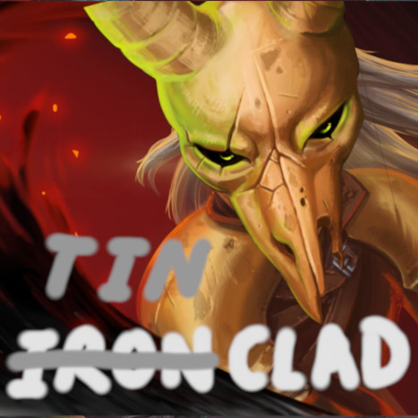

去年七八月份心血来潮，突然想做个[杀戮尖塔](https://store.steampowered.com/app/646570?snr=5000_5100__)的mod，于是做了一些调查，用了一两个星期~~粗制滥造~~把“脆皮战士”做了出来。卡牌的设计大概只用了两三天，然后接下来的一个多星期一张一张逐一实现出来，边做边测。卡图画完之后就放到了创意工坊上面。（和一些打磨很久的mod相比，还是不够匠心）。创意工坊链接如下，感兴趣可以玩一下：

> [https://steamcommunity.com/sharedfiles/filedetails/?id=3306830639](https://steamcommunity.com/sharedfiles/filedetails/?id=3306830639)

本文主要是记录一下当时卡牌的设计思路，还有制作mod的整个过程，免得以后忘了。

## 思路

在原版当中，**敏捷、荆棘、多层护甲**这几个power虽然有出现，但是在玩家身上用得很少，即使有，数值也给得很扣。敏捷只有猎人能加，而且只能加2点。荆棘和多层护甲基本上只能靠遗物。

### 名字来由

之所以叫做“脆皮战士”，是因为我本来打算照搬战士的机制，但是用在**敏捷**上面。虽然机制类似战士，但是因为脆皮，所以只能像猎人那样闪躲——脆皮战士。就结果而言，和战士、猎人都不像，所以创意工坊的大图有点欺骗的意味（



### 以敏捷为核心

我本意是以这几个机制为核心，特别是敏捷。原计划把原版用在**力量**上面的设计直接搬到**敏捷**上，~~就结果而言，根本行不通~~。稍微给点数值就会破坏整个游戏体验。敏捷稍稍加一点，就能极大提高防御能力，让怪变得没啥威胁；荆棘则相当于每回合稳定加伤，因为尖塔的怪攻击欲望一般都比较强；多层护甲只要超过一个临界值，基本上相当于无敌。所以为了充分利用这些机制，又不破坏游戏体验，**必须引入一些debuff来做平衡。**

> ps. 尖塔优先鼓励攻击而不是防御，这样设计是有道理的，如果防御比攻击容易太多，怪物会变得没有威胁，整个游戏会变得十分无聊。
> 
> 因此，怪物的血条比玩家的长很多，输出比~~启动之后~~的玩家低很多。一场战斗中怪物一般会有一定的成长，玩家必须启动得比怪物快。如果玩家的构筑牌组无法在输出上成长，那么按照原版的数值来说，基本上必死无疑。一局游戏中，玩家牌组的平均输出也得比怪物的数值膨胀快才行，不然迟早倒在某一层。

为了以敏捷为核心，我考虑了这几种debuff：

- 输出和运转的成长要牺牲敏捷，比如过牌，加费，加力量，获得残影、缓冲
- 临时敏捷
- 把单纯的防御牌变少
- 牺牲血量换敏捷
- 降低基础防御数值，考虑把一部分格挡拆分到下回合
- 给敌人叠甲
- 敌人意图是攻击是才加敏捷——让加敏捷和叠甲争用有限的费用

不过测试下来，debuff加太多有点偏弱，所以最后金卡基本上没啥debuff，甚至有过牌和敏捷兼得的牌，初始卡组的基础防御数值也只降了一点点；减少防御牌也不是一个好设计，会大大提高叠甲的方差。所以根本上还是要让敏捷能够转换成输出，因此加了一张失去少量敏捷，但造成敏捷量n倍伤害的牌，实测敏捷和输出的互换不能1:1，1:3~1:5会好一些。

为了博点上限，自然会有一些翻倍的设计，不过敏捷翻n倍似乎意义不大，线性增加一般就足够了。所以翻倍主要靠增加叠甲频率，少量多次，相当于叠甲翻倍。另外就是敏捷翻倍换力量。敏捷直接翻倍的牌是有的，但是只给临时敏捷。**纯敏捷流**是可行的，但是启动需要关键牌，比如有一张烧牌拿敏捷的牌。

卡牌列表可以参考[这个腾讯文档](https://docs.qq.com/sheet/DUmVveGJUTUJOZ3hE?tab=BB08J2)，但是以实际代码为准。

### 荆棘，缠绕，击晕

荆棘的数值很难调整。不过脆皮战士本来就是输出低、防御高，引入荆棘也算是一种补强。因为机制太粗暴了，怎么砍数值都没啥用，而且加上尖塔的怪攻击欲望都比较高，**荆棘流**可能是目前最容易赢的策略了。有一张将荆棘翻倍的牌，加快叠荆棘的速度，可能是上限最高的牌之一。

我本以为缠绕会比原版就有的中毒强，但实测下来，即使加上了一些翻倍的机制，还是不强。根本原因在于缠绕的结算时间——怪物回合结束时结算，所以很多情况下，用中毒可以斩杀，但用缠绕不能。**缠绕流**可玩，但是不强。所以我把缠绕和击晕挂钩了起来，多给缠绕一点奖励。

还有一张牌可以给敌人加力量，但是击晕一回合。不过击晕没法形成流派。

### 无限？

无限和翻倍一样，是比较危险的设计。但是为了博一下上限，整个牌组还是有无限的可能性，只要集齐几张关键牌就行了。只要玩家构筑目的足够明确，无限是比较容易的，但至于的启动快慢，就要看运气了。

“脆皮战士”的无限和**消耗**这个机制挂钩，消耗-回忆-消耗这个循环，是无限的核心。**回忆**类似战士的**发掘**，但发掘不能发掘发掘，回忆可以回忆回忆。升级后的回忆可以一次回忆两张牌，所以只要有两张回忆，就能无限。下一节“特殊机制”里面会提到，拿到回忆的手段是相对丰富的，不一定非要在牌组里有回忆这张牌。

所以与其说是无限，不如说是**消耗流**。有了双无限之后，问题只剩下怎么早点把牌都烧掉，并且稳定地变出费用来。

还有一种以来敌人意图的伪无限。敌人意图不是击晕的时候，**良机**这张牌可以用于过牌，如果牌组足够小，有两张良机，并且有0费牌或者费用魔术，就能无限。

### 特殊机制

为了让角色更特别一些，加入了一个找回童年记忆的设定。**追忆**这张牌会往消耗堆中加入一张诅咒牌（**往事**），只要把往事从消耗堆回忆出来，就会加入牌组。往事被移除出牌组的时候，可以获得特殊遗物——一定程度上算是质变。**反省**会往消耗堆当中加入一张**平凡形态**。消耗堆中的牌没有那么容易获得，即使获得了里面的牌，要打出费用还是很高，所以这种玩法有一定的门槛。

**平凡形态**是一张形态牌，效果是获得很多层人工制品。对于脆皮战士来说，很多层人工制品是可以完全改变玩法的。前面提到，为了平衡掉敏捷带来的大量防御能力，很多牌都有副作用，一旦打出平凡形态，副作用就没了，极大提高强度。

**匆忙打击**在打出之后会随机消耗两张牌，此外，*它的基础伤害会更新为上一次实际造成的伤害*+一个小随机数。因此更新基础伤害这个机制，使得它可以自成一个流派。

还有一个隐藏流派，需要特殊事件才能解锁（所以请多走问号房间）。

> 大致思路就这些，感谢你看到这里，~~快去[创意工坊](https://steamcommunity.com/sharedfiles/filedetails/?id=3306830639)订阅~~

## 如何开始写mod

> 这部分主要参见[BasicMod](https://github.com/Alchyr/BasicMod/wiki)。

尖塔的mod全部都要依赖ModTheSpire才能运作，原理大概是给尖塔打patch。直接从ModTheSpire上手显然太难了，所以有了[BaseMod](https://github.com/daviscook477/BaseMod)，提供了一个比较友好的接口，比如说要自定义卡牌，直接继承`CustomCard`然后开始写代码就行了。不过BaseMod的文档还是不够友好，好在[BasicMod](https://github.com/Alchyr/BasicMod)出现了，可以理解为BaseMod的使用示例，加上step by step的文档，对我这种Java苦手友好多了。

很多mod都会引入StsLib这个依赖。StsLib源自著名mod“崩坠”❲downfall❳，里面包括了一些常用的效果——有效避免了每个modder都重复造一些轮子。

### 准备好BasicMod

把BasicMod的源码整个搞下来，参照[它的wiki](https://github.com/Alchyr/BasicMod/wiki)改改`pom.xml`。基本上没有什么坑，这里没有必要再把wiki抄一遍。

### 参考尖塔和其他mod的源码

尖塔的源码非常重要，很多东西的实现需要自己去源码里面看~~，然后你就会发现一堆奇葩实现~~。看完之后可以直接抄来用。

卡牌主要有几个要点，Attack、Defense和一个Magic Number。Attack和Defense都有对应的Base Attack、Base Defense，对应没有任何加成的版本。所有其他可变动的数值一般都要放在Magic Number里面实现。——尖塔描述学第一定律，一张牌至多只有三个数可以变。

BasicMod里面只有英文的示例，如果要多语言本地化，需要在localization文件夹下面新增语言。以简体中文（`zhs`）为例，在`localization`下面新建`zhs`文件夹，然后把英文`eng`下面的那些`*String.json`全部复制进来，一个一个改。游戏中会把关键字自动标黄，如果需要自己加关键字，改`Keywords.json`，比如：
```json
{
  "ID": "Chained",
  "PROPER_NAME": "连锁",
  "NAMES": [ "连锁" ],
  "DESCRIPTION": "若攻击伤害未造成生命值减少，则再造成一次攻击伤害。连锁n表示至多触发n次。"
}
```
只要卡牌中出现“连锁”这个词，就会被标黄。一个关键词可以有多个NAME，但ID必须唯一。所有ID前面都会自动加上`${modID}:`，也就是你的modID加上冒号，所以在卡牌描述里也必须得加上：
```json
"${modID}:Test": {
  "NAME": "试探",
  "DESCRIPTION": "造成 !D! 点伤害 NL modbynth233:连锁 3， 若未触发连锁，获得一张 modbynth233:良机",
  "UPGRADE_DESCRIPTION": "造成 !D! 点伤害 NL modbynth233:连锁 3， 若未触发连锁，获得一张 modbynth233:良机+"
}
```

### 发布到创意工坊
到尖塔的安装目录下面，如果是Linux用Steam安装的，一般在：
```
~/.local/share/Steam/steamapps/common/SlayTheSpire
```
里面会有个`mod-uploader.jar`文件。执行下面的命令会新建一个叫`my-mod`的文件夹（可以自己换成别的名字）
```
java -jar mod-uploader.jar new -w my-mod
```
文件夹里有个`README.md`告诉你接下来该怎么做。改改`config.json`，把编译好的jar包放到contents里，换掉`image.jpg`，最后大概像这样：
```
my-mod
├── config.json
├── content
│   └── modByNth233.jar
├── image.jpg
└── README.md
```
最后执行：
```
java -jar mod-uploader.jar upload -w my-mod
```
就能把mod发布到Steam创意工坊上。
以我的为例，`config.json`大概长这样：
```json
{
  "steamPublishedID": "xxxxxxxxxx",
  "title": "Tinclad 脆皮战士",
  "description": "请先安装 Dependency: BaseMod, StsLib, ModTheSpire \n A Character which plays with Dexterity, Thorn, Constricted and other mechanisms uncommon in the base game. \n 一个以敏捷为核心的简单角色，尽可能保持机制和数值极简。把原版比较少用的机制发挥了一下（比如荆棘、缠绕、缓慢）。 \n Github：https://github.com/fpg2012/modByNth233",
  "visibility": "public",
  "changeNote": "[2024-08-18] Fix bugs: \n - Net+ do not exhaust itself\n - Dispose, Recall, FlashBack crash the game due to mistakes in my English translation JSON files",
  "tags": [
    "Character",
    "English", "Simplified Chinese"
  ]
}
```
往`tags`当中加入对应的语言，才会使你的mod显示在对应语言的分区里面。

## 吐槽

我很不喜欢BaseMod组织卡牌贴图的方式，一张卡牌一个图片文件，非常琐碎。所以尝试自己写，试图直接加载整个atlas。虽然可能粗看可能看不出什么问题，但是bug很多。

附，朋友写的一点文案：

> 这塔里想要活下去，就要不断的战斗。但是，你的力量太弱小了，唯有追求更快的速度，躲避怪物的攻击，找准间隙还击，一点一点蚕食对方，才有赢的可能。记住，在这里，战斗只为了生存，任何超出这条界线的想法，都只会让你再经历一遍「那种痛苦」。
> 
> 「那你为什么有时候宁愿挨怪物一击，也要攻击它们呢？」
> 
> 「那是因为我的血脉法术。我能燃烧血液来快速治疗伤口，你学不来——
> 
> 「受了伤，你的行动就会渐渐迟缓，然后再被击伤，最终“死掉”。」
> 
> 说完，面具男拔出刀竖立在面前，把刀面当做镜子一动不动地端详着自己脸上的面具，他的目光闪烁着。他的名字，他的脸，还有他此时此刻的想法，都埋葬在了这冰冷的，早已失去光泽的金属面具后面。他的一切，早就在那一天全都卖给了那个恶魔，甚至被尼奥复活的痛苦，不知道何时起也无法撼动他麻木的心，如果，自己胸口跳动的，还是心脏的话。
> 
> 如今，唯一能让他还感觉自己活着的，只剩下身旁的少年了。
