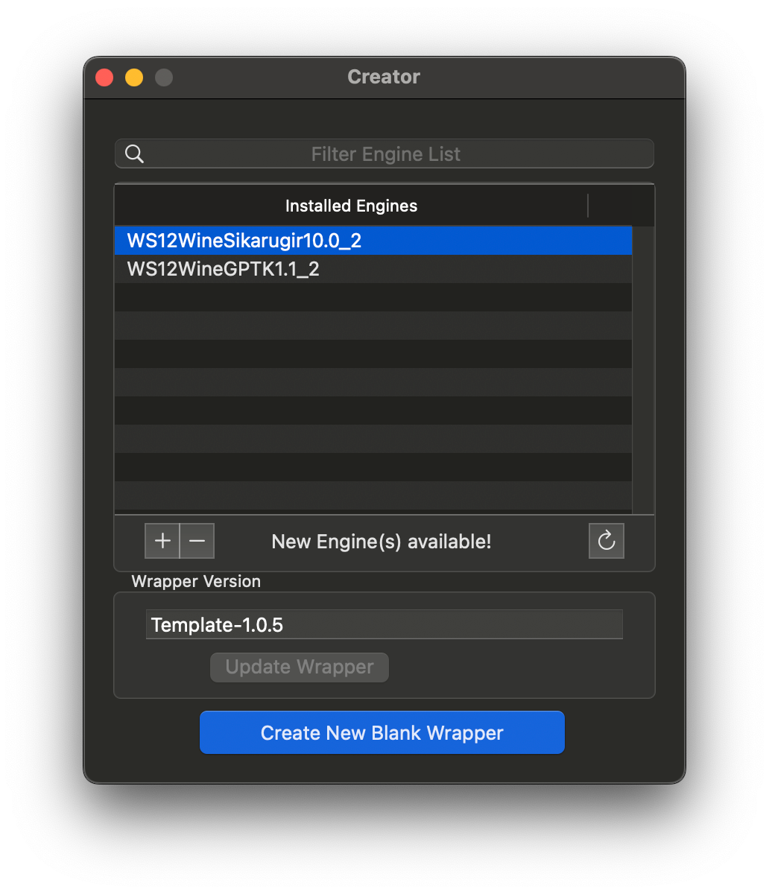

我几个月前才把日用系统从Linux改成MacOS。总体上，mac是个精致、统一且易用的系统。但还是有不少雷点：

1. 些许有些不同的命令行生态（这个我勉强能自适应，但显然Linux要顺手得多）
2. 文件系统支持（无解……这方面mac被Linux完爆。为了日用，我不得不把移动硬盘从btrfs转回exFAT）
3. 远程桌面（xfreerdp + xquartz勉强解决了我的rdp需求）
4. **steam上能玩的游戏少得可怜，甚至不如Linux**

针对第四点，现在终于找到了一个能用的解法。

## mac上的wine和GPTK

对于近几年的Apple Silicon设备来说，虽然仍然可以通过rosetta跑wine，体验很差，对于游戏来说基本上不可用，主要是因为没有Vulkan的支持。几年前Apple端出GPTK，才总算是有个游戏能用的兼容层。

但是我看了GPTK混乱的文档之后，还是不知道怎么配，折腾半天还是搞不定。本来这方面有个体验很不错的开源软件，可以帮助用户用GPTK装上能用的steam，但不知道什么原因，Whisky目前停止维护了，文档的开头劝用户“去买CrossOver”。

反正我不会买。因此退而求其次，在V社把proton端上arm mac之前，先折腾其他的开源方案。

目前唯一相对方便的方案应该是[Sikarugir](https://github.com/Sikarugir-App/Sikarugir)（如果还有别的方案我不知道，请在评论区踢我一下）。Sikarugir的文档藏在discord频道上，查看起来还是不够方便。

## Sikarugir的安装和配置

用brew安装

```
brew install --cask Sikarugir-App/sikarugir/sikarugir
```

装好之后应该会有sikarugir creator这个应用。

打开之后，点下面的“+”添加engine，选WS12WineSikarugir10.0_2



装好后engine后，点最下面的Create New Blank Wrapper，随便起个名（假设叫做steam.app）。选D3DMetal，并且**在winetricks当中安装steam和中文字体**（这点比较坑，不看文档根本不知道要这样搞），不建议自己手动安装steam。


如果之后要改配置，或者用winetricks装别的东西，可以打开下面这个文件，就可以回到这个界面。

```
~/Applications/Sikarugir/steam.app/Configure.app
```

至此，steam就装好了，直接打开steam.app即可使用windows版本的steam。