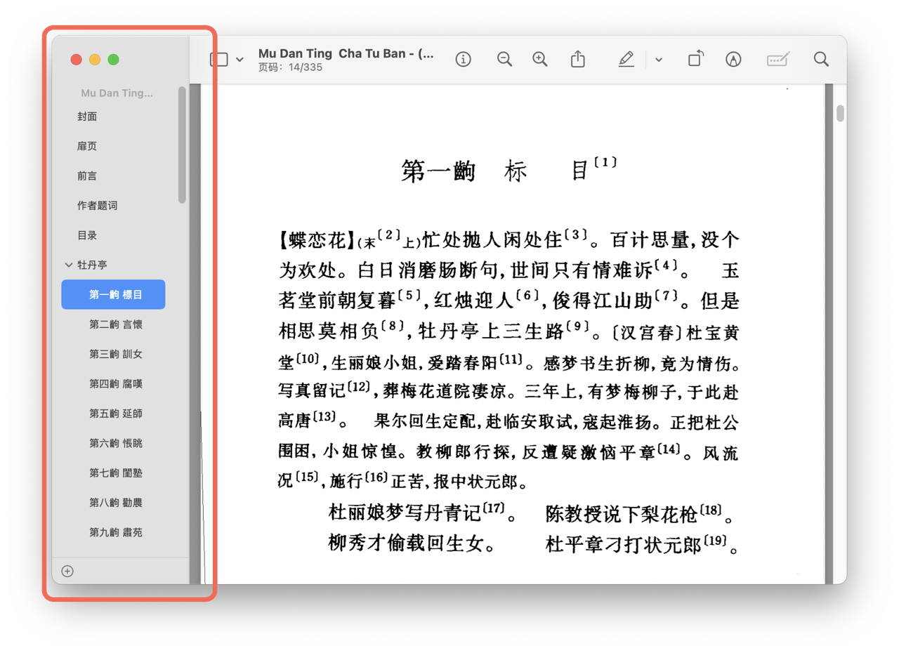

这两个月花了点时间，写了一个pdf解析器和pdf目录（outline）的编辑器，算是部分解决了我编辑pdf目录的需求。关于两个库的编译和使用，可以参考各自的README和文档。

> GitHub Repo：
>
> - [pdf-outline](https://github.com/fpg2012/pdf-outline) 基于JSON的pdf目录编辑工具，依赖pindf、libicu
> - [pindf](https://github.com/fpg2012/pindf) 底层pdf文档解析库（非常low-level），基本上只依赖zlib

以前我囤了很多扫描版pdf。这些pdf制作不是很精良，往往没有目录，很难检索。当时我没找到合适的开源软件来做这件事。几个月前重新看了一下pdf的spec，简单评估之后，我认为我可以一周把这个东西做出来（实际上前前后后做了两个月……）。

这里说一下啥是outline。outline有些地方直接叫做“书签”，有些地方叫“目录”，有些地方叫“概览”。总之就是打开pdf之后，显示在侧边栏里面的目录，点击里面的项可以跳转到对应的地方，就是下图框起来的区域：



## 底层解析库

底层解析库我起名为libpindf。随便乱取的，就是在「pdf」中间插入一个「in」。

### 如何解析一个PDF？

一个初次创建的PDF主要包括几个部分：

1. 版本号注释（文件的开头类似`%%PDF-1.5`的一行）
2. PDF主要内容，主要是一大堆的indirect object
3. xref表。一个速查表，可以根据object的标号，速查对应的indirect object在文件中的哪个位置。
4. trailer。一个字典，指出Catalog对象的位置
5. startxref。这一行后面给出了xref表在文件中的位置
6. 最后以`%%EOF`结束

PDF的主要内容由一大堆indirect object组成。所谓object，就是整数、浮点数、null、名字、字典、数组、字符串、流的统称。流比较特殊，主要用来放一些连续的二进制数据，由一个字典和一串原始二进制数据组成。

间接对象（indirect object）则是带编号的对象。根据编号，可以在字典、数组这种复合对象里面引用它们。trailer当中会引用Catalog对象这个对象。Catalog当中有页面树、目录树、名字树等等东西。PDF的所有内容都用这棵树组织起来。

是不是听起来很简单？我一开始也这么觉得，但是实际做起来发现，**PDF标准充满各种历史包袱**，相同的功能可能可以用不同的方式来实现。因此要支持大部分的PDF，还是需要花很多时间研读标准。

> 举个例子，我原本不打算实现流对象的解析，但后期的PDF标准为了进一步缩小体积，会把对象放到流的二进制数据里面，用特殊的格式压缩。这就迫使我不得不去解析各种流，硬控了我一周的时间。xref表也有流的版本。

### 如何修改PDF

PDF支持追加式的修改。所谓追加，就是指可以在上述完整的文件结构后面，再接上一个完整的文件结构。新的xref表格会覆盖原始xref表的对应部分——这意味着我们可以添加新的indirect object，并且通过修改xref表，替换掉原先相同对象号的object。最后，需要在trailer当中加上`/Prev`这个属性，指出老的xref表的位置。

这种追加式修改可以叠加无数层，在流传的PDF当中非常普遍。但PDF的这种设计，导致解析器必须从文件末端开始解析，先找到startxref，然后解析trailer，然后解析xref表，一层一层地解析回去，直到找到最初的那个trailer和xref表，做起来还是挺麻烦的。这种结构也对浏览器不友好（比如传了完整文件才能开始阅读），所以PDF还支持对文档做“线性化”，线性化后的PDF只有一个xref和一个trailer，1号对象放在最前面，就是catalog对象，对浏览器比较友好。

### 为啥要自己造轮子？

为了爽。

我原本想要直接用现成的库，比如mupdf之类的。但这些库的文档感觉不是特别完善，并且一般都是read-only或者create-only，于是就一直搁置。直到某一天，我弄丢了手机，断网了一晚上，无事可做，于是乎决定纯手工写个纯C的解析器。靠着manual和手边的几个离线文档手工起了项目，从此一发不可收拾。尤其是在AI时代，沉下心来纯手工做这个东西是真爽。

写lexer差不多只用了一天，parser一周做到了85%的完成度。然后因为纯C的种种麻烦之处，剩下的10%用了我两周的时间……目前我只敢说做到了（95%）的完成度。大部分pdf都是可以处理的，除非是加密的pdf/用了奇怪filter的pdf。

接下来就是编辑pdf。PDF支持追加式的编辑，所以理论上我只需要一个read-only搭配一个create-only的库，就能实现我原本想做的编辑操作。但我意识到这点的时候已经太晚，parser都已经快写完了。

### 复盘

不应该用纯C来写，手工管理内存和所有权实在是太麻烦，如果改用rust，甚至哪怕是C++，应该真的一周就能搞定。

## Outline编辑器

在libpindf的基础上，编辑outline相对简单。只要找到目录树（outline树），然后把它替换掉，即可实现修改outline。

### 如何编辑？

由于懒得写图形界面，我打算采用JSON作为一个中间格式。先把outline提取出来，翻译成json，人工编辑json之后，再翻译成一系列indirect object，替换到原先的outline树，就能实现编辑。

### 具体实现

理论简单，但具体实践起来，又花了我好几天时间。

一个点是，PDF的目录有好几种实现方法。outline树中的节点需要有两个信息，

- 标题，决定了怎么显示这个节点

- 跳转目的地：可以指向某个Destination对象，也可以指向某个Action对象。

这两个要素各自有若干种写法，支持起来很烦人

#### 标题的两种写法

title有两种编码方式，默认使用所谓的“pdf encoding”，基本上就是诡异版的unicode，欧元符号之类的东西用特殊的编码，历史包袱很重。如果以某两个特殊字节开始，表示使用大端序的UTF-16。

用现在的眼光看来非常莫名其妙。个人不太喜欢大端序，写代码的时候总要专门去反转顺序……但偏偏PDF标准就是喜欢用大端序，在各种各样的地方都选择大端序。

#### 目的地的n种写法

Action对象有非常多种，除了跳转外，“打开网页”、“播放声音”甚至“播放视频”之类的都有……因此理论上点击pdf目录项还可以播视频……

跳转Action的内部会引用一个Destination，因此殊途同归。Destination会引用它要跳转的那个Page，或者是对应位置的name，还可以指定跳转到页面的那个位置（写坐标）……甚至能规定跳转之后采用哪种缩放方式。如果跳转目的地写name，还需要去name tree里面检索对应的真实page object是哪个，极度麻烦。

我目前不支持用Action。可以选择填Destination（需要按照pdf的语法自己写destination object），或者填页码。推荐填页码，心智负担最小。

#### 示例JSON

示例JSON如下（只写页码）：

```json
{
    "chd": [
        {
            "title": "前言",
            "destination": {
                "page": 5
            }
        },
        {
            "title": "作者题词",
            "destination": {
                "page": 10
            }
        },
        {
            "title": "目录",
            "destination": {
                "page": 11
            }
        },
        {
            "title": "牡丹亭",
            "destination": {
                "page": 14
            },
            "chd": [
                {
                    "title": "第一齣 標目",
                    "page": 14
                },
                {
                    "title": "第二齣 言懷",
                    "page": 17
                },
                {
                    "title": "第三齣 訓女",
                    "page": 21
                },
            ]
        },
        {
            "title": "附录",
            "page": 323,
            "chd": [
                {
                    "title": "附录一 关于版本的说明",
                    "page": 323
                },
                {
                    "title": "附录二 杜丽娘慕色还魂画本",
                    "page": 326
                }
            ]
        }
    ]
}
```

## 下一步？

手工做目录还是太麻烦了，下一步看看能不能借助现在的VLM模型/OCR模型，半自动地把目录标出来。

上半年有时间的话做个工作流来试试看。大体的想法是，先找到书籍的目录，然后借助现有的目录，让VLM/OCR模型精读前几章，总结一下经验，然后跳读整本书。

## Ref

- [Adobe PDF 1.7 标准文档](https://opensource.adobe.com/dc-acrobat-sdk-docs/pdfstandards/pdfreference1.7old.pdf)
- [pdf-outline - GitHub](https://github.com/fpg2012/pdf-outline)
- [pindf - GitHub](https://github.com/fpg2012/pindf)
