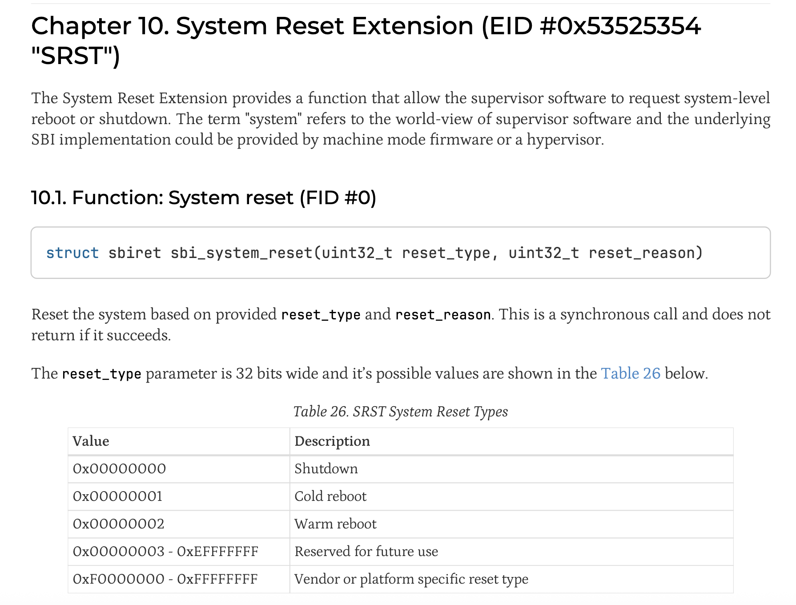
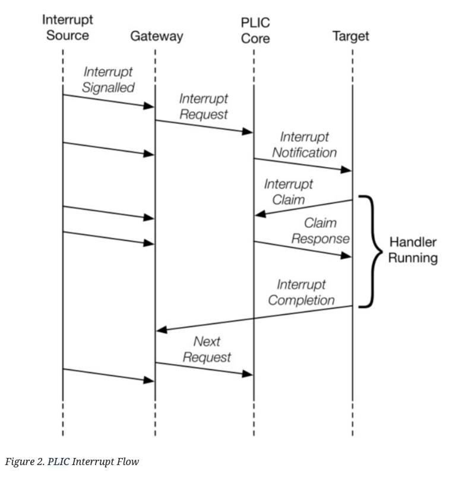

> 写OS是以前的念想。我不可能沿着这条路走下去，也不可能在这种方向找到工作，但还是想尝试一些没有做过的事情——哪怕没有什么“意义”。

主要记录一下这两天折腾riscv裸机程序。也许以后有时间可以继续把bare bone扩写成OS（但概率很低了，时间精力越来越不支持我做这些无法变现的东西）。

环境

- qemu 11.0
- u-boot 2026.04
- opensbi v1.8.1
- riscv64-linux-gnu-系列，gcc、gdb、binutils之类的

本来想在starfive visionfive 2的板子上试试，但是S-mode没玩明白，还是算了。

## Exp1 S-mode程序

尝试使用opensbi + uboot在S-mode引导我的程序。

编译opensbi：

```
make ARCH=riscv CROSS_COMPILE=riscv64-linux-gnu- PLATFORM=generic FW_OPTIONS=0 
```

编译uboot（注意替换opensbi firmware的路径）：

改配置

```
make menuconfig
```

编译

```
make ARCH=riscv CROSS_COMPILE=riscv64-linux-gnu- OPENSBI=${PATH_TO_OPENSBI}/build/platform/generic/firmware/fw_dynamic.bin -j8
```

### 概念

#### 机器

qemu virt这个机器上电的时候，pc初始化为`0x80000000`，从这个地方开始执行所有的代码。

在riscv架构下，特权层大概分为三层：

- M-mode，机器模式，权限最高的模式，可以执行所有指令。opensbi运行在这个模式。
- S-mode，supervisor模式，操作系统运行在这个模式。S-mode的程序通过SBI，使用M-mode下opensbi提供的服务。实际上也是用ecall之类的指令触发软中断。
- U-mode，用户模式。也就是用户态。用户态程序通过ABI使用OS提供的接口（也是用ecall指令）。

OpenSBI是一个广泛使用的SBI实现。SBI提供的服务包括开关机、输出字符之类的，类似UEFI的地位。

从底层高权限到高层低权限，实际上就是设置某些CSR（控制状态寄存器）的特权位。后续再想回到M-mode，只能靠trap陷入了。

使用uboot编译产生一个固件（这里是SPL），CPU上电之后，先进入M-mode，此时入口地址正好是uboot的M-mode程序。uboot启动opensbi之后，再调用自己的S-mode部分。

我们可以使用uboot加载自己的程序到内存中，比如`load`系列命令，加载完之后，直接一句`go`指令就可以跳转过去。当然对于使用linux内核格式的程序/elf程序，还可以使用`boot`系列命令。

#### RISC-V汇编快速复习

总体上比较简单。一般以`i`结尾表示涉及到立即数，否则就是操作寄存器。以`a`结尾表示涉及地址。`l`表示load，`s`表示save。第一个操作数就是目标寄存器。结尾的`b`、`w`表示byte、word。如：

- `li`：加载立即数
- `la`：加载地址
- `add`：加法
- `sb`：写一个byte到对应的地址
- `bne`：不等则跳转
- `auipc`：往PC上加个数

读写CSR可用`csr`系列的指令

- `csrr`：从某个csr读到某个寄存器
- `csrw`：写某个csr
- `csrs`：置位某个csr（csr和某个寄存器OR一下，然后写回csr上）

#### 编译和链接

C语言的程序要能运行，至少需要一个东西：栈。栈的初始化必须使用汇编来完成。另外全局变量一部分是定义在bss段的，也顺便定义一下。bss段要求初始化为0。

链接脚本告诉链接器每个段应该放到哪个位置，重定位之后，所有的指令都能有正确的地址。

#### 外设

UART串口是机器debug的时候，最常用的通信方式。根据virt这个机器的内存映射定义（github上能找到），UART_BASE的地址是`0x10000000`。往这个地址写字符就是输出到UART。

### 程序

链接脚本，指定了某些段应该放在什么位置。我们的程序入口放在`0x80400000`。

```
OUTPUT_ARCH(riscv)
ENTRY(_start)
SECTIONS
{
    . = 0x80400000;
    .text : { *(.text.init) *(.text) }
    . = 0x80600000;
    .rodata : { *(.rodata) }
    .data : { *(.data) }
    .bss : { *(.bss) }
}
```

汇编

```assembly
.section .text
.globl _start

_start:
    # 清空 .bss 段
    la t0, __bss_start
    la t1, __bss_end
    sub t1, t1, t0
    li t2, 0
1:  sb t2, 0(t0)
    addi t0, t0, 1
    addi t1, t1, -1
    bnez t1, 1b
    # 设置栈指针（需 16 字节对齐）
    la sp, _stack_end
     # 跳转到 C 的 main 函数
    call main

loop:
    nop
    j loop

.section .data
.align 4
_stack_start:
    .skip 1024
_stack_end:

.section .bss
.align 4
__bss_start:
    .skip 1024
__bss_end:
```

C语言程序

```C
#define UART0_BASE 0x10000000
#define UART_RBR 0
#define UART_THR 0
#define UART_IER 1
#define UART_LSR 5
#define UART_LSR_THRE (1 << 5)
#define UART_IER_RDI (1 << 0)

#define UART_IRQ 10

void put_char(char ch) {
    *(volatile unsigned char *)(UART0_BASE + UART_THR) = ch;
}

void print(char *str) {
    while (*str) {
        put_char(*str++);
    }
}

int main() {
    print("Hello, RISC-V!\n");
    return 0;
}

```

可以把最后的死循环改成调用SBI关机。这块可以参考SBI的文档。

```assembly
# shutdown (call sbi srst extension)
li a0, 0
li a7, 0x53525354
li a6, 0
ecall
```

就和系统调用感觉上差不多。a7寄存器放SBI扩展ID，a6寄存器放函数ID。

这里用到的SBI接口是：



所以a0设为0，表示关机、a7设为`0x53525354`表示system reset扩展，a6设为0表示system reset函数。

### 编译运行

```
riscv64-elf-as -march=rv64imac_zicsr -mabi=lp64 -o boot.o boot.S
riscv64-elf-gcc -march=rv64imac -mabi=lp64 -mcmodel=medany -c -o main.o main.c
riscv64-elf-ld -T link.ld -o start.elf boot.o main.o
riscv64-elf-objcopy -O binary start.elf start.bin
```

启动虚拟机

```
qemu-system-riscv64 -nographic -machine virt \
    -bios uboot/spl/u-boot-spl \
    -device loader,file=uboot/u-boot.itb,addr=0x80200000 \
    -device loader,file=start.bin,addr=0x80400000
```

我们的程序会被加载到`0x80400000`。进入uboot之后，敲命令

```
go 0x80400000
```

即可跳转到我们的程序了。

## Exp2 M-mode程序和中断处理

涉及中断的时候，感觉一切都变复杂了，所以先回退到M-mode。我暂时不指望这部分代码能直接拿到真实的板子上跑。

### 概念

#### risc-v的中断模式

riscv-privilege的文档手册非常的琐碎难读，不过幸好这年头有AI。

有4个CSR对M-mode的中断非常关键：

1. `mtvec`
2. `mstatus`
3. `mie`
4. `mcause`

当有中断发生的时候，CPU会直接把PC设置为`mtvec`，即直接跳转过去（这点不同于传统的中断向量，后者直接把中断向量当作是服务程序的地址）。因此我们要把中断服务程序的首地址写到`mtvec`里面）

跳转后，中断服务程序可以读取`mcause`寄存器，里面存着中断的类型（异常/软中断/外部中断），根据具体的类型，进一步跳转到实际的中断处理程序。

只有启用了中断之后，才能收到中断信号。这里有两个地方要设置：

1. `mstatus.MIE`这个bit要置1，这个是个全局的开关，如果不开，永远收不到中断
2. `mie.MEIE`要置1，这个是外部中断的开关

中断服务程序首先要保护现场，处理结束之后再恢复现场。最后`mret`实现中断返回。

> 如果是S-mode，需要把`mtvec`换成`stvec`，以此类推。

#### PLIC

具体到处理外部中断，还需要涉及PLIC（platform-level-interrupt-controller，平台级中断控制器），用来管理中断优先级之类的东西。

查看virt的内存映射之后，可以找到PLIC_BASE对应的内存地址是`0x0c000000`。从`0x0c000000 + 0x2000`开始是PLIC使能区域blabla等等。

```c
#define PLIC_BASE 0xc000000
#define PLIC_ENABLE_OFFSET 0x2000
#define PLIC_PENDING_OFFSET 0x1000
#define PLIC_THRESHOLD_OFFSET 0x200000
#define PLIC_CLAIM_OFFSET 0x200004
```

具体可以查看PLIC文档memory map的部分。

要让UART中断能发生，PLIC这边需要：

1. 启用这个中断
2. 中断优先级大于我们设置的阈值

具体处理中断的时候，我们需要CLAIM/COMPLETE。假设前面机器中断的部分已经进入了中断服务程序，并且知道了mcause就是外部中断，此时CLAIM就是从PLIC的CLAIM_OFFSET取出当前优先级最高的中断号。读取这个内存地址，同时也是告诉PLIC，“看看现在有什么中断要我处理”。COMPLETE就是把在中断处理完了之后，把中断号写回去，告诉PLIC（我处理完了，把这个中断从队列里面去掉）。



#### UART

在virt机器上，UART对应的PLIC中断号是0xA，也就是10。UART自己也有个启用和关闭中断的开关，需要打开。

```C
#define UART0_BASE 0x10000000
#define UART_RBR 0
#define UART_THR 0
#define UART_IER 1
#define UART_LSR 5
#define UART_LSR_THRE (1 << 5)
#define UART_IER_RDI (1 << 0)

void init_uart() {
    // Enable receive-data-available interrupts in the 16550 UART.
    *(volatile unsigned char *)(UART0_BASE + UART_IER) = UART_IER_RDI;
    (void)*(volatile unsigned char *)(UART0_BASE + UART_RBR);
}
```

来了中断之后，需要把UART缓冲区的字符读掉，才能清掉UART的状态。

这块具体得参考16550的手册。

### 程序

链接脚本

```
OUTPUT_ARCH(riscv)
ENTRY(_start)
SECTIONS
{
    . = 0x80000000;
    .text : { *(.text.init) *(.text) }
    . = 0x80200000;
    .rodata : { *(.rodata) }
    .data : { *(.data) }
    .bss : { *(.bss) }
}
```

汇编

```assembly
.section .text
.globl _start

_start:
    # 清空 .bss 段
    la t0, __bss_start
    la t1, __bss_end
    sub t1, t1, t0
    li t2, 0
1:  sb t2, 0(t0)
    addi t0, t0, 1
    addi t1, t1, -1
    bnez t1, 1b

    # 设置栈指针
    la sp, _stack_end

    # 设置中断向量
    la t0, int_vec
    csrw mtvec, t0
    
    # 使能机器模式外部中断（MEIE）
    li t0, (1 << 11)
    csrs mie, t0
    
    # 使能全局中断
    csrsi mstatus, 8   # 设置 MIE 位
    
    # 跳转到 main
    call main

loop:
    wfi # wait for new interrupt
    j loop

int_vec:
    addi sp, sp, -80
    sd ra, 0(sp)
    sd t0, 8(sp)
    sd t1, 16(sp)
    sd t2, 24(sp)
    sd t3, 32(sp)
    sd a0, 40(sp)
    sd a1, 48(sp)
    sd a2, 56(sp)
    sd a3, 64(sp)
    sd a4, 72(sp)

    csrr t0, mcause
    bgez t0, int_done          # 最高位为 0 表示异常，不是中断
    slli t0, t0, 1
    srli t0, t0, 1
    li t1, 11                  # Machine external interrupt
    bne t0, t1, int_done

    li t0, 0x0c200004          # PLIC claim/complete, hart 0 M-mode
    lw t1, 0(t0)               # claim IRQ id
    li t2, 10                  # UART0 IRQ on QEMU virt
    bne t1, t2, plic_complete

    li t3, 0x10000000          # UART0 base
    lb a0, 0(t3)               # 读取 RBR，清掉 RX pending
    sb a0, 0(t3)               # 回显收到的字符

plic_complete:
    sw t1, 0(t0)               # complete IRQ

int_done:
    ld ra, 0(sp)
    ld t0, 8(sp)
    ld t1, 16(sp)
    ld t2, 24(sp)
    ld t3, 32(sp)
    ld a0, 40(sp)
    ld a1, 48(sp)
    ld a2, 56(sp)
    ld a3, 64(sp)
    ld a4, 72(sp)
    addi sp, sp, 80
    mret

.section .data
.align 4
_stack_start:
    .skip 1024
_stack_end:

.section .bss
.align 4
__bss_start:
    .skip 1024
__bss_end:

```

C语言部分

```c
#define UART0_BASE 0x10000000
#define UART_RBR 0
#define UART_THR 0
#define UART_IER 1
#define UART_LSR 5
#define UART_LSR_THRE (1 << 5)
#define UART_IER_RDI (1 << 0)

#define PLIC_BASE 0xc000000
#define PLIC_ENABLE_OFFSET 0x2000
#define PLIC_PENDING_OFFSET 0x1000
#define PLIC_THRESHOLD_OFFSET 0x200000
#define PLIC_CLAIM_OFFSET 0x200004

#define UART_IRQ 10

void put_char(char ch) {
    while ((*(volatile unsigned char *)(UART0_BASE + UART_LSR) & UART_LSR_THRE) == 0) {
    }
    *(volatile unsigned char *)(UART0_BASE + UART_THR) = ch;
}

void print(char *str) {
    while (*str) {
        put_char(*str++);
    }
}

void init_plic() {
    // Enable UART interrupt
    *(volatile unsigned *)(PLIC_BASE + PLIC_ENABLE_OFFSET + (UART_IRQ / 32) * 4) |= (1 << (UART_IRQ % 32));
    // Set priority for UART interrupt
    *(volatile unsigned *)(PLIC_BASE + (UART_IRQ * 4)) = 1;
    // Set threshold to 0 to allow all interrupts
    *(volatile unsigned *)(PLIC_BASE + PLIC_THRESHOLD_OFFSET) = 0;
}

void init_uart() {
    // Enable receive-data-available interrupts in the 16550 UART.
    *(volatile unsigned char *)(UART0_BASE + UART_IER) = UART_IER_RDI;
    (void)*(volatile unsigned char *)(UART0_BASE + UART_RBR);
}

int main() {
    init_uart();
    init_plic();
    print("Hello, RISC-V!\n");
    return 0;
}

```

## Ref

- [UART Ref](https://www.ti.com/lit/ug/sprugp1/sprugp1.pdf?ts=1777326944780)
- [RISC-V PLIC Spec](https://github.com/riscv/riscv-plic-spec)
- [RISC-V Privilege](https://docs.riscv.org/reference/isa/priv/priv-intro.html)
- [linker scripts - osdev wiki](https://wiki.osdev.org/Linker_Scripts)
- [risc-v sbi doc](https://github.com/riscv-non-isa/riscv-sbi-doc)
